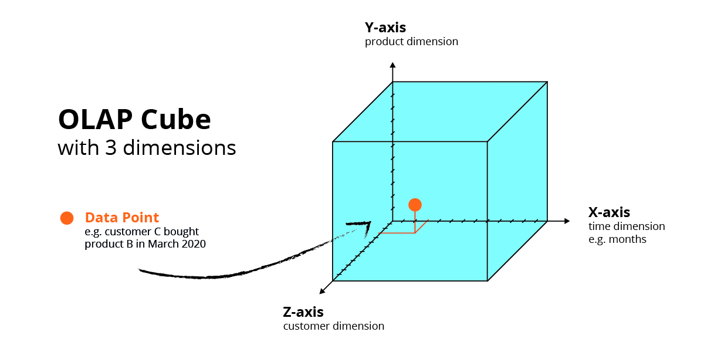

======================================
Componentes de consumo y visualización
======================================

Las organizaciones que quieren competir y ganar necesitan inteligencia, inteligencia aplicada a los clientes, proveedores, productos, partners y mercados. El último paso dentro de una arquitectura de procesamiento de datos debe poder materializar esta inteligencia y entregarla de forma correcta y a tiempo al negocio. Con los años, esta búsqueda de inteligencia ha recibido diferentes nombres: sistemas de soporte a la toma de decisiones, sistemas de información gerencial, gestión del desempeño empresarial, descubrimiento de datos, visualización de datos y, más recientemente, Business Intelligence (BI).

Independientemente del nombre, el desafío siempre ha sido el mismo: ¿De qué manera pueden las organizaciones analizar los datos para hacer descubrimientos con los que obtener una ventaja competitiva?

Evolución
---------

El concepto de BI no es nuevo. Sin embargo, muchas de las estrategias que se habían desarrollado en un principio eran o demasiado complejas o terminaban causando frustración. Con el paso del tiempo, el concepto de BI se fué acercando un poco más al objetivo final que perseguía. Dicho de otro modo, en cada paso nos acercamos más a poder por fin materializar todo el valor de los datos.

Primera generación: Centralizada
********************************
En esta primera generación, las tecnolgoías de BI se centraba en dos funciones principales: producir datos e informes y organizarlos para permitir visualizarlos de una forma inteligible. Con una gestión del dato muy centralizada, y a raíz del desarrollo de dichas funciones, nacieron sus problemas derivados, en este caso la **complejidad y el tiempo**. 

Esta generación se caracterízo por consistir de complejas tecnológias que analizaban conjuntos de datos multidimensionales o cubos de datos OLAP. Estos cubos de datos se ejecutan en :ref:`rst_data_warehouse`.

   *Ejemplo de un cubo de análitica (OLAP) de 3 dimensiones.*

Normalmente, estos cubos los gestionaba un equipo central del departamento de informática de la organización y lo importante eran los datos estructurados. Casi todos los proyectos necesitaban de expertos de IT para funcionar, de tal forma que la mayoría de usuarios no eran capaces de llevar a cabo tareas por sí mismos ya que, en esencia, las herramientas de BI habían sido diseñadas para expertos en analíticas avanzadas. 

Esto generaba un problema enorme de acumulación de datos que penalizaba la entrega a tiempo de informes hacia los responsables de la toma de decisiones. Poco a poco, esto condujo a una evolución de las herramientas de BI para su uso por individuos con conocimientos menos técnicos; hacia la segunda generación.

Segunda generación: Decentralizada
**********************************
Una segunda generación puso sobre la mesa herramientas más rápidas a la par que complejas. Potenciadas por las ventajas de la computación en la nube, su acceso se volvió mucho más fácil. Principalmente, 4 elementos se introdujieron:

#. Se eliminó la compleja pila tecnológica.
#. Se añadió métodos sencillos para preparar y cargar datos.
#. Se desarrolló un sistema visual e intuitivo de interacción entre el usuario y los datos.
#. Se desarrollaron motores de ejecución que permitieron a todos los usuarios (aunque no estén especializados) explorar con libertad sus datos, dirigirlos en cualquier dirección y descubrir sus interconexiones.

.. figure:: ../_images/arch-viz-semantic.jpg
   :alt: Ejemplo de una arquitectura típica de soluciones decentralizadas para BI
   :align: center

   *Ejemplo de una arquitectura típica de soluciones decentralizadas para BI.*

Aproximadamente en 2005, la necesidad de tener información a tiempo real se volvía vital para la empresa que quería estar por delante de sus competidores en un mundo saturado de información, así como para entender más en profundidad lo que los consumidores querían y pensaban sobre la esa misma compañía. Fue en este punto donde el BI comenzó a descentralizarse y empezó a dejar de verse como un apoyo al negocio; sino como una parte esencial de cualquier compañía que quisiese mantenerse relevante en su negocio.

El desafío de la gobernanza
^^^^^^^^^^^^^^^^^^^^^^^^^^^
En esta nueva tendencia de BI, la tecnología adquirió la capacidad de analizar muchos más tipos de datos, incluidos los datos no estructurados, los datos sociales e incluso conjuntos de datos personales administrados en hojas de cálculo de Excel. Esto provocó un nuevo problema: la desorganización causada por fuentes de datos múltiples, duplicadas o poco
fiables. A fin de cuentas, ni siquiera la analítica más sofisticada es exacta si los datos no son seguros. La mayoría de los proveedores ignoraba este problema y dejaban que el cliente lo solucionase. En Qlik, entendimos desde el principio la importancia de tener datos exactos y desarrollamos una estructura segura y gobernada para proporcionar un análisis fiable.

El obstaculo de la adopción
^^^^^^^^^^^^^^^^^^^^^^^^^^^
¿Cuál es el obstáculo principal que impide que BI llegue a toda la empresa? Los empleados no cuentan con la suficiente alfabetización de los datos, es decir, la capacidad de leer y analizar datos y de trabajar e interactuar con ellos. Un estudio global realizado por Qlik en 2017/2018[1] mostró que solo el 24 % de los directivos en las empresas se consideraban alfabetizados en datos. 

Tercera generación: Democratizada
*********************************
Esta tercera generación ha conducido al mundo hacia una **democratización del dato absoluta**; una forma de entender su acceso como algo obligatorio para toda la organización con el fin de obtener mayores conocimientos. Las herramientas de visualización self-service han propulsado esta democratización con el uso de un motor de indexación de datos asociativa y su uso en multi-cloud y dispositivos móviles, concediendo al usuario final la capacidad de explorar los datos libremente y sin fronteras.

.. figure:: ../_images/arch-viz-3rd.jpg
   :alt: Necesidades del usuario en torno a visualización de información
   :align: center

   *Necesidades del usuario en torno a visualización de informació.*

Para lograrlo:

:Democratización de los datos via catálogos de datos: Todos los datos (y toda combinación de los mismos) quedan accesibles a todos los usuarios mediante catálogos de información gobernados, que abarcan a toda la empresa y que están preparados para la analítica.
:Descubrimiento: Los origenes de datos son escaneados e indexados, lo que acelera el proceso de descubrimiento y aumenta la alfabetización de los datos y la confianza.
:Análitica embebida: La analítica ya no es un destino, sino que juega un papel en todas las decisiones y forma parte de los procesos empresariales diarios a través de embedded analytics. Esto concierne tanto a las decisiones humanas como a las automáticas, en áreas como la automatización y el IoT.

.. [1] Estudio realizado por Censuswide para Qlik. En el estudio, se consultó a 7377 directivos (junior managers y superiores). Los encuestados se encontraban en Europa, EE. UU. y Asia. El estudio se realizó entre agosto de 2017 y febrero de 2018. Censuswide se rige por las directrices de la "Market Research Society" (basadas en los principios ESOMAR) y emplea a algunos de sus miembros.