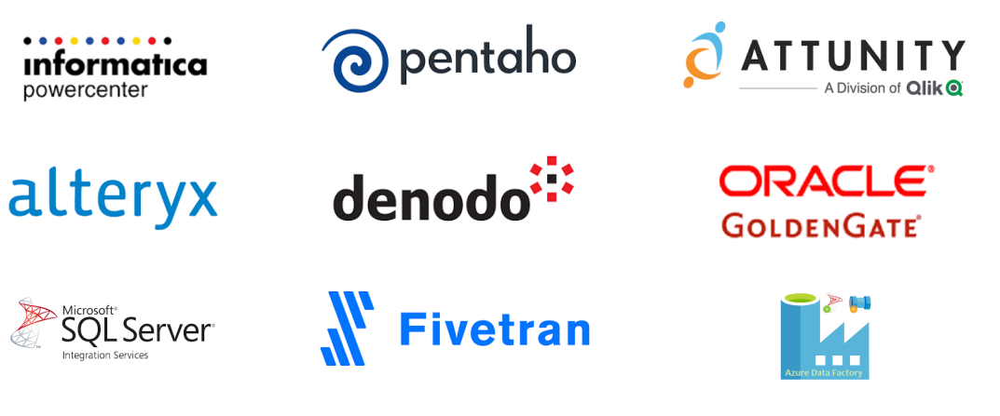

======================
Componentes de ingesta
======================

Se refiere a las maneras en las que se pueden obtener e importar datos, ya sea para uso inmediato o para ser almacenados. Importarlos también incluye el proceso de prepararlos para un análisis. En un sentido más amplio, la ingesta de datos puede ser entendida como un flujo dirigido entre dos o más sistemas que resulta en una operación fluida e independiente.

¿Que podemos ingestar?
----------------------

En general podemos ingestar:

* Origines propios:

  * Bases de datos transaccionales como ser sistemas ERP, CRM, BPM, etc.
  * Archivos de la organización.
  * Datos provenientes de aplicaciones.
  * Telemetría de la operación o dispositivos conectados de la organización.

* Origenes de terceros:

  * De ingeta permitida: Datos provenientes o colectados por terceros, que habilitan conexión a la organización. Ej: Redes Sociales.
  * Open-data: Datos publicados por organizaciones públicas o privadas. Los datos abiertos son datos que pueden ser utilizados, reutilizados y redistribuidos libremente por cualquier persona, y que se encuentran sujetos, cuando más, al requerimiento de atribución y de compartirse de la misma manera en que aparecen.

Tipos de ingesta
----------------

De igual forma que vimos en :doc:`../../concept/velocity`, la velocidad impacta en todos los componentes de la arquitectura de datos. En general, encontraremos 3 tipos de ingesta de datos:

:En tiempo real (real-time): En una ingesta en tiempo real, los datos son adquiridos tan rápido como es posible. En general, para que esto sea posible el dato es capturado cuando la transacción es confirmada y antes de que se realice cualquier otro procesamiento en el origen.
:En stream (streaming): En un principio, stream podría parecer similar a real-time, sin embargo existe una gran diferencia. En una ingesta en tiempo real, el dato se adquiere tan pronto como es posible, independientemente de si otros datos han sido adquiridos o no. Sin embargo, en una ingesta en stream, el orden es importante y por lo tanto son ingestados en el orden en el que son generados o capturados (dependiendo del caso).
:En lotes (batch): Los datos son ingresados en cantidades específicas en periodos definidos en "lotes". Por ejemplo, cada día se podrían ingestar los datos generados durante el día anterior.

Fase de la ingesta
------------------

En general, durante la ingesta de datos, las siguientes operaciones se realizan:

:Extracción: Los datos se recolectan desde el origen.
:Transformación: Los datos son transformados para conformar el destino donde serán almacenados. Esto puede incluir validar, limpiar, normalizar o vincular datos asegurandose su precisión y confiabilidad.
:Carga: Colocar los datos en el silo o base de datos de destino.

Los sistemas que realizar las operaciones en el orden presentado se los conoce como **ETL** (por las siglas em inglés de cada uno de los pasos). Sin embargo, no es mandatorio hacerlos en ese orden - o incluso - no es mendatorio hacerlos a todos, especialmente el de **Transformación**. Por ejemplo, muchos sistemas de análitica avanzada optan por realizar la transformación de los datos en otras herramientas de procesamiento no ligadas a la ingesta. Estas estrategias se las conoce como **ELT** (nuevamente por sus siglas en inglés).

Desafíos en arquitecturas de datos
----------------------------------

Mientras los datos crecen, estos pasos se hacen más grandes y toman más tiempo. Las compañías tienen
numerosas fuentes de datos que funcionan las 24 horas del día. Los ingresos vienen en una variedad de
formatos, por lo que una conversión a similares es necesaria. Así, cada vez más organizaciones están
implementando la automatización para hacer más eficiente la ingesta de datos.

Razones para Automatizar la Ingesta de Datos
********************************************

:Mejora los objetivos del time to market: En 2016, 55 por ciento de las compañías B2B dijeron que su incapacidad para unir datos de una gran cantidad de fuentes de forma rápida les impedía cumplir con el objetivo. Adicionalmente, las compañías gastan tiempo preparando el análisis; pero si la ingestión de datos no ha sido eficiente, entonces no habrá datos que analizar, lo que retrasa el cumplimiento de las metas.
:Aumenta la escalabilidad: Se escogen una o dos fuentes de datos y se determina la mejor forma para automatizar basándose en las mejores prácticas de la industria y luego se agregan más. Es mas, si bien una ingesta automatizada requiere algunos ajustes manuales, luego no requiere grandes cambios en las técnicas de ingesta.
:Enfoque en el proyecto: Las estadísticas indican que el 80 por ciento de un proyecto de analítica se invierte en esta labor, en lugar de desarrollar algoritmos particulares y analizar los resultados. Al automatiza el sistema, los data scientists pueden llevar a cabo el trabajo que la compañía quiere: por ej: en el análisis que lleve a mejoras en los productos que están por lanzarse.
:Mitiga el riesgo: Los datos son clave en la inteligencia de datos y estrategia. Automatizar los datos también mitiga otros riesgos: error humano durante la extracción, transformación y carga, quedarse atrás al no poder estar al día con la información recolectada, o el de la posibilidad de hacer más cosas.

Herramientas
------------

Las siguientes son algunos ejemplos de herramientas disponibles en el mercado:

   *Herramientas de ingesta y transoformación de datos.*
