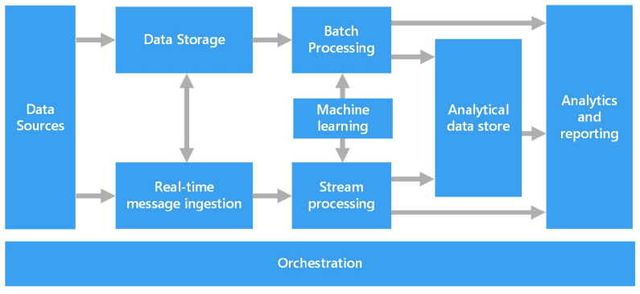
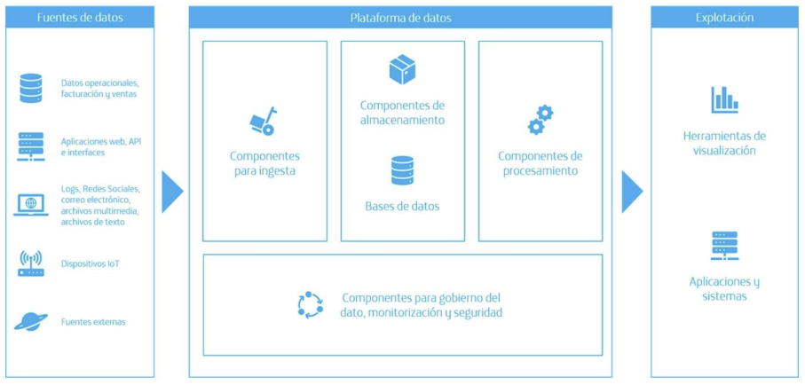

==========================
Organización y componentes
==========================

Una arquitectura de procesamiento de datos empresariales están diseñada para manejar la ingesta, el procesamiento y el análisis de datos en aquellos casos donde los mismos son demasiado grandes o complejos para los sistemas de bases de datos tradicionales.

Organización
------------

Estas arquitecturas generalmente involucran uno o más componentes que son responsables de llevar adelante las siguientes tareas:

* Procesamiento de :ref:`rst_data_batch` y en reposo.
* Procesamiento en tiempo real de :ref:`rst_data_stream`.
* Exploración interactiva de datos.
* Analítica predictiva y aprendizaje automático.

   *Elementos en una arquitectura de datos empresarial*

Componentes
-----------

Desde un punto de vista de arquitectura, las tareas que se mencionaron anteriormente son llevadas a cabo por deferentes componentes técnologios que la organización puede implementar para materializar así una arquitectura de datos coherente.

   *Componentes en una arquitectura de datos empresarial*

La mayoría de las arquitecturas de procesamiento de datos consisten en operaciones de procesamiento de datos que se ejecutan de forma repetida. Estas operaciones están encapsuladas en procesos que transforman los datos, los mueven entre múltiples sistemas de almacenamiento, o envían los resultados directamente a un informe o tablero. Estos procesos deben estar orchestrados en la plataforma para que funcionen de forma coherente y puedan entregar los resultados que el negocio espera. Este es el rol de los componentes de orquestración.

.. toctree::
    :maxdepth: 2
    :caption: En esta sección

    sources
    ingest
    store
    process
    analytics
    consume