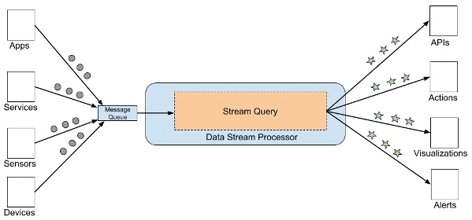

============================
Componentes de procesamiento
============================

De igual forma que vimos en :doc:`../../concept/velocity`, la velocidad impacta en todos los componentes de la arquitectura de datos. En este caso, tenemos componentes de procesamiento de datos por lotes, en stream y en tiempo real.

Procesamiento por lotes
-----------------------

Debido a que los conjuntos de datos son tan grandes, a menudo una solución de big data debe procesar archivos de datos mediante largas ejecuciones de procesamieento de datos para filtrar, agregar y preparar los datos para el análisis. Por lo general, estos trabajos implican leer archivos del origen, procesarlos y escribir la salida en archivos nuevos.

Cuando utilizarlo
^^^^^^^^^^^^^^^^^

El procesamiento por lotes generalmente experimenta latencias al procesar los datos. Sin embargo, para muchas situaciones, este tipo de demora no es un gran problema: aquellos procesos que requieren los valores procesados al día siguiente, una vez a la semana, una vez al mes, suelen tener estas características.

El procesamiento por lotes debe considerarse en situaciones en las que:

- Las transferencias y los resultados en tiempo real no son cruciales.
- Es necesario procesar grandes volúmenes de datos.
- Es necesario acceder los datos en lotes.
- Es necesario acceder a todo el conjunto de datos a la vez (muchos algoritmos complejos deben tener acceso a todo el conjunto para computar determinados valores).
- Las tablas en las bases de datos relacionales deben unirse con multiple origenes de datos, lo cual demora tiempo.
- El trabajo es repetitivo.

Ventajas
^^^^^^^^

Hay una serie de razones por las que las empresas implementan sistemas de procesamiento por lotes:

- Son más baratos de implementar.
- Operan off-line: Los sistemas de procesamiento por lotes funcionan fuera de línea, por lo que cuando finaliza la jornada laboral, los sistemas por lotes aún se procesan en segundo plano, avanzando lentamente.
- Faciles de mantener
- Simples: En comparación con el procesamiento en tiempo real, es significativamente menos complejo ya que no requiere soporte constante del sistema para la entrada de datos.
- Escalamiento: Son más sencillos de escalar.

Desafíos
^^^^^^^^

También hay algunas preguntas a tener en cuenta al diseñar procesamiento por lotes:

- ¿Cómo asegurase de que los trabajos se realicen correctamente?
- ¿Cómo determinar que se han enviado y procesado los datos en el orden correcto?
- ¿Tiene trabajos de procesamiento esperando para comenzar que están supeditados a que se complete otros?
- ¿Cómo determinar que trabajos están siendo procesados y cuales están encolados?
- ¿Qué sucede si un trabajo de procesamiento falla y se reintenta? ¿Qué impacto tiene? 
- ¿Cómo se rastrean las dependencias entre procesos de datos?

Procesamiento en alta velocidad
-------------------------------

Tiempo real
^^^^^^^^^^^

Después de capturar datos en tiempo real, la arquitectura de datos debe procesarlos filtrando, agregando y preparando los datos para el análisis. Un componente puede clasificarse como **de tiempo real** si puede garantizar que el procesamiento se producirá dentro de un plazo ajustado de tiempo, generalmente en cuestión de segundos o milisegundos.

Uno de los mejores ejemplos de un sistema en tiempo real son los que se utilizan en el mercado de valores. Si una solicitud de cotización se debe realizar 10 milisegundos posteriores a su colocación, esto se consideraría un proceso en tiempo real. Es irrelevante si esto se logró mediante el uso de una arquitectura de datos que utilizó procesamiento efectivamente en tiempo real o dentro de unos segundos; la garantía de un plazo ajustado de tiempo es lo que lo hace en tiempo real.

Stream
^^^^^^

Los datos en **stream** se refieren a datos que se generan continuamente, generalmente en grandes volúmenes y a alta velocidad. Generalmente consisten en registros continuos con una marca de tiempo (timestamp) que registran eventos a medida que ocurren, como un sensor que informa la temperatura actual.

Una sola fuente de datos en stream podría generar cantidades masivas de estos eventos cada minuto. En muchos casos, en su forma sin procesar, estos datos corresponden a datos semiestructurados. Esto hace muy difícil trabajar con ellos ya que la falta de esquema y estructura dificulta la consulta con herramientas analíticas basadas en SQL. Los datos deben procesarse, analizarse y estructurarse antes de que se pueda realizar un análisis más profundo. Esto hace que los datos basados en stream en general sean considerados para procesamiento utilizando ELT (extract-load-transform) en lugar de ETL (extract-transform-load). En otros casos, el procesamiento se divide en 2, realizando tareas sencillas en ETL y tareas mas complejas en ELT.

Herramientas
^^^^^^^^^^^^

Algunos ejemplos de herramientas ETL de código abierto para el procesamiento de datos en tiempo real y stream son Apache Storm, Spark Streaming y WSO2 Stream Processor. Si bien estos marcos funcionan de diferentes maneras, todos son capaces de escuchar flujos de mensajes, procesar los datos y guardarlos en el almacenamiento.

   *Esquema de componentes de tiempo real y stream.*

Tecnologias de nube como Azure Stream Analytics o AWS Firehorse proporcionan un servicio de procesamiento de datos en alta velocidad administrado que permite a las organizaciones disponer de una técnologia de procesamiento de eventos con garantias de performance.

Desafíos de la velocidad
^^^^^^^^^^^^^^^^^^^^^^^^

Si bien este tipo de sistemas puede parecer superiores, la realidad es que los sistemas en tiempo real son extremadamente difíciles de implementar. El flujo de control que procesa los datos no es tan evidente porque el sistema en tiempo real elige qué tarea ejecutar en que momento. Esto es beneficioso, ya que permite una mayor productividad utilizando una mayor abstracción y puede facilitar el diseño de sistemas complejos, pero significa menos control en general, lo que puede ser difícil de depurar y validar.
