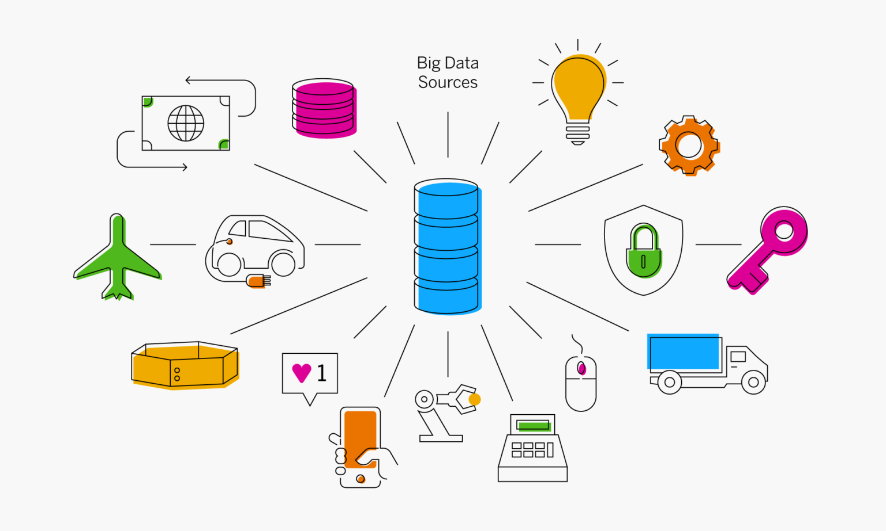

=================
Origenes de datos
=================

Haciendo una analogía con la distribución de agua en una ciudad, las fuentes de datos son los pozos, lagos y arroyos que son utilizados como origenes de agua para luego procesarla y finalmente ditribuirla a los consumidores. Un origen de datos entonces es el sitema de donde una organización recopila (o contrata) datos por primera vez.

En cualquier organización, encontraremos datos en múltiples aplicaciones de linea de negocio, bases de datos, lagos de datos y, en muchos casos, nubes públicas y privadas. Por lo general, los datos no pertenecen a un grupo específico dentro de una organización y, a menudo, se comparten entre equipos y aplicaciones.

   *En cualquier organización, encontraremos diversos origenes de datos.*

Para compartir datos de manera eficiente, las empresas deben centrarse en integrar sus datos de manera automatizada y oportuna. Esto puede ser un desafío cuando las unidades funcionales usan múltiples aplicaciones y almacenan datos en múltiples ubicaciones. Las organizaciones necesitan una arquitectura de integración de datos para conectar fuentes de datos primarias y secundarias, normalizar la información y automatizar el flujo de información sin intervenciones manuales. Este procedimiento se conoce como **ingesta de datos** y es tarea de los :doc:`ingest`. 

Características deseables de un origen de datos
-----------------------------------------------

En general, buscamos origines de datos que tengan las siguiente 5 características, que son las más importantes a la hora de considerar un activo de datos:

- Completo
- Contextual
- Creíble
- Actualizado
- Único

Multiples origines de datos
---------------------------

Para tomar decisiones acertadas, nos interesa tener las 5 características presentadas anteriormente. Sin embargo, conseguir estas 5 características en cada originen de datos suele ser desafiante, por lo cual muchas organizaciones requieren poder consumir multiples origenes datos, combinarlos e integrarlos con otros origenes de datos para tener representaciones de datos de mayor valor.

- Algunos datos solo se pueden encontrar en una única fuente de datos y en ningún otro lugar.
- Cuando exiten brechas en los datos, solamente podremos inferirlas cuando comparamos dos o más fuentes de datos.
- Necesitamos múltiples fuentes de datos con campos repetidos que sirvan para correlacionar activos de datos y llegar a un inventario de activos único y sin duplicado. Si bien hay muchos campos de datos superpuestos entre la mayoría de las fuentes de datos, cada fuente de datos contendrá algunos datos que son únicos para esa fuente de datos en particular. Estas piezas únicas de datos, le brindan completitud y contexto. Algunas perspectivas sobre el activo solo existen en una única fuente de datos.
- Cuantas más fuentes de datos contienen datos superpuestos, más fuerte será la correlación y más campos de datos tendrá como puntos de comparación, sin embargo mas ardua será la tarea de deduplicación.
- Es en la agregación de datos donde encontramos **la verdad**. La verdad no se puede obtener de una fuente de datos. *Confiar pero verificar*.