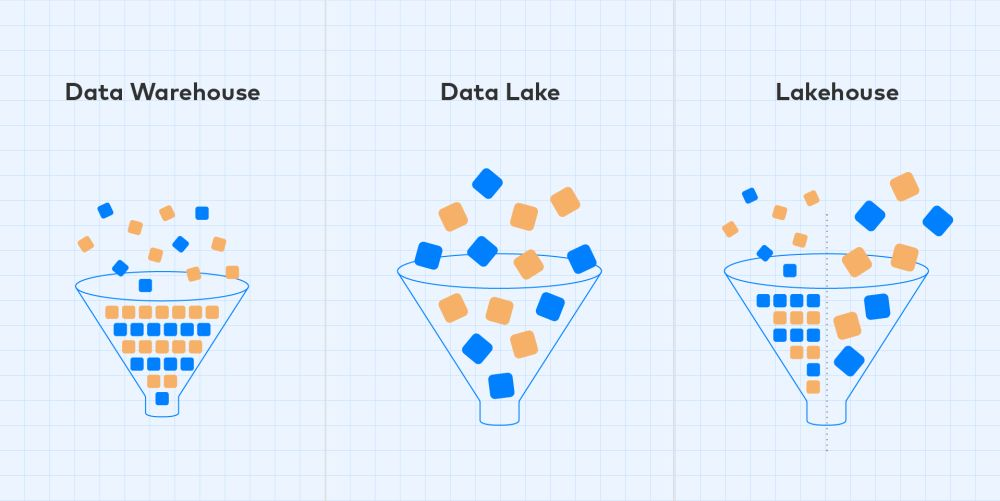

=============================
Componentes de almacenamiento
=============================

Los componentes de almacenamiento de datos diferen entre si dependiendo de los :doc:`../../concept/data-types` a almacenar. Los datos estructurados suelen almacenarse en sistemas tradicionales de bases de datos. Los datos no estructurados generalmente se almacenan en un almacén de archivos distribuido que puede contener grandes volúmenes de archivos de diversos tamaños y en varios formatos. Este tipo de almacenamiento a menudo se denomina data lake. Sin embargo, esta separación no es tan definida y existen otros aspectos a tener en cuenta a la hora de elegir una técnología de almacenamiento, que se mencionan a continuación.

Técnologías
-----------

Bases de datos
^^^^^^^^^^^^^^

Una base de datos es un sistema de almacenamiento de datos donde los mismos se procesan, organizan, administran, actualizan y luego almacenan en tablas. Las bases de datos tienen una variedad de sabores: estructuradas, relacionales, no-estructuradas (conocidos como 'NoSQL').

Debido a que una base de datos está estrechamente relacionada con las transacciones que realiza una organización, en general una base de datos realiza un procesamiento transaccional en línea (OLTP).

Características principales de las bases de datos:

* Estructurado de acuerdo con las operaciones y aplicaciones de la organización.
* Reglas rígidas establecidas en torno al almacenamiento/organización de datos (específico de RDBMS).
* Almacenamiento de datos flexible (específico de NoSQL).
* De un solo propósito en su naturaleza: maneja un proceso.
* Utilizado para el procesamiento de transacciones en línea (OLTP).
* Capacidades de registro de datos, captura de transacciones a medida que ocurren y alojamiento de esas transacciones.

.. _rst_data_warehouse:

Data Warehouse
^^^^^^^^^^^^^^

Un Data Warehouse es el sistema central de una organización para realizar consultas analíticas. El Data Warehouse funcionará en conjunto con sistemas transaccionales "almacenando" los datos capturados de los mismos. Por ejemplo, supongamos que una empresa tiene bases de datos del sistema de facturación, una del sitio web, datos de clientes y datos de recursos humanos. En ese caso, el Data Warehouse tomará los datos de estas fuentes y los pondrá a disposición en una sola ubicación. 

El Data Warehouse muchas veces maneja el proceso de limpieza y normalización de los datos, preparándolos para el almacenamiento centralizado. El proceso de extraer datos de la base de datos, transformarlos y cargarlos en el Data Warehouse se lo suele denominar *proceso de extracción, transformación y carga (ETL)*.

Debido a que un Data Warehouse captura datos históricos transformados (es decir, limpios), es una herramienta ideal para el análisis de datos. Debido a que las unidades de negocios aprovecharán los datos del almacén para crear informes y realizar análisis de datos, las unidades de negocios frecuentemente están involucradas en cómo se organizan los datos. Al igual que una base de datos relacional, normalmente usa SQL para consultar los datos y usa tablas, índices, claves, vistas y tipos de datos para la organización e integridad de los datos.

Debido a que la intención principal es el análisis, se utiliza tecnologías para el procesamiento analítico en línea (OLAP) optimizados para tal fin.

Características principales de un Data Warehouse:

* Almacena grandes cantidades de datos históricos para que los datos antiguos no se borren cuando se actualicen datos nuevos.
* Captura datos de múltiples bases de datos dispares.
* Funciona con procesos de ETL para alojar datos limpios y normalizados.
* Aplicación OLAP (procesamiento analítico en línea).
* Son la principal fuente de datos para el análisis de datos.
* Los informes y dashbords usan datos de Data Warehouses en general.

Data Mart
^^^^^^^^^

Un data mart es muy similar a un Data Warehouse. Al igual que un Data Warehouse, el data mart mantendrá y albergará datos limpios y listos para el análisis. Sin embargo, a diferencia de un Data Warehouse, los data mart mantienen una vista acodata a un proceso o vertical de negocio.

Un data mart proporciona datos orientados a temas necesarios para respaldar una unidad de negocios específica. Por ejemplo, se podría crear un data mart para respaldar los informes y análisis del departamento de marketing. Al limitar los datos a una unidad comercial en particular (por ejemplo, el departamento de marketing), la unidad comercial no tiene que filtrar datos irrelevantes.

Otro beneficio es la seguridad. Limitar la visibilidad de los datos no esenciales al departamento elimina la posibilidad de que esos datos se utilicen de manera irresponsable.

Un tercer beneficio es la velocidad. Como habrá menos datos en el data mart, se reduce la sobrecarga de procesamiento. Esto significa que las consultas se ejecutarán más rápido.

Finalmente, debido a que los datos en el data mart se agregan y preparan para ese departamento de manera adecuada, se reduce la posibilidad de mal uso de los datos. También se reduce el potencial de informes contradictorios.

Principales Características de un Data Mart:

* Se centra en un tema o unidad de negocio
* Actúa como un mini-Data Warehouse, manteniendo datos agregados
* Los datos tienen un alcance limitado
* A menudo utiliza un esquema en estrella o una estructura similar

.. note:: En la actualidad, el uso de Data Mart es desalentado por la existencia de productos de Data Warehousing con capacidades avanzadas que limitan las ventajas de un Data Mart. Los Data Warehouse en general suelen ser más económicos de mantener y proponen un repositorio centralizado para la organización que desalienta la existencia de silos de datos.

Data Lake
^^^^^^^^^

Un Data Lake almacena los datos sin procesar y procesados ​​(estructurados, semi-estructurados y no estructurados) de una organización a gran y pequeña escala. A diferencia de un Data Warehouse o una base de datos, un Data Lake captura cualquier cosa que la organización considere valiosa para uso futuro. Pueden ser imágenes, videos, archivos PDF, etc. El Data Lake es entonces el destino donde se integran datos de múltiples fuentes de datos dispares. Además, al igual que un Data Warehouse, un Data Lake se puede utilizar para el análisis de datos y la creación de informes. Sin embargo, la tecnología utilizada en un Data Lake es mucho más compleja que en un Data Warehouse.

Para su procesamiento y análisis se utilizan diferentes aplicaciones y tecnologías que pueden procesar los datos almacenados aqui. Debido al nivel de complejidad y habilidad requerido para aprovechar un Data Lake ,requieren usuarios con experiencia en lenguajes de programación y técnicas de ciencia de datos. Por último, a diferencia de un Data Warehouse, un Data Lake no aprovecha un plataforma de procesamiento de datos para su limpieza.

Características principales de un Data Lake:

* Recopila todos los datos de muchas fuentes de datos dispares durante un período prolongado.
* Satisface las necesidades de varios usuarios en la organización.
* Son sistemas de almacenamiento altamente económicos.

Lakehouse
^^^^^^^^^

Una Lakehouse es una nueva arquitectura que combina los mejores elementos de los Data Lake y los Data Warehouse. Los mismos implementan estructuras de datos y funciones de administración de datos similares a las de un Data Warehouse pero directamente sobre la misma técnología de almacenamiento utilizada por los Data Lakes.

   *Un lakehouse combina las capacidades de almacenamiento de datos no estructurados de un data lake con las capacidades de manejo de datos estructurados de un Data Warehouse.*
