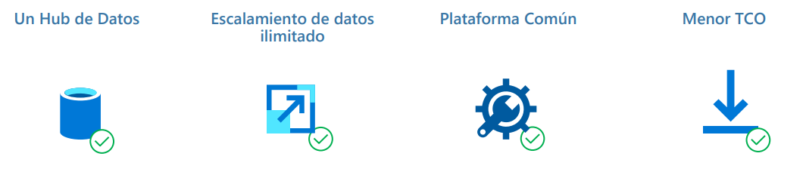

====================================
Arquitecturas de datos empresariales
====================================

   "The next morning, Nashe and Pozzi learned that building a wall was not as simple as they had imagined. Before the actual construction could get underway, all sorts of preparations had to be attended to. Lines had to be drawn, a trench has to be dug, a flat surface had to be created. 
   
   -*You can't just plop down stones and hope for the best*, Murks said. *You've got to do things right*."

   -- The music of chance (Paul Auster, 1990)

..
   "A la mañana siguiente Nashe y Pozzi descubrieron que construir un muro no era tan sencillo como habían imaginado. Antes de empezar la construcción en sí había que hacer toda clase de preparativos. Había que trazar líneas, cavar zanjas, crear una superficie plana.

   –No podéis dejar caer las piedras simplemente y esperar que quede bien – les dijo Murks. Tenéis que hacer las cosas como Dios manda."

   -- La música del azar (Paul Auster, 1990).

Las Arquitecturas de datos Empresariales son los modelos, políticas, reglas y estándares que nos indican de qué manera tenemos que almacenar, organizar e integrar los datos que recoge una organización con el objetivo de que sean aprovechables y útiles. En la nueva era del Big Data, es de vital importancia para una empresa tener una arquitectura de datos centralizada, alineada con los procesos comerciales, que se adapta al crecimiento del negocio, y que evoluciona con los avances tecnológicos.

Desafios de las arquitecturas de datos Empresariales
----------------------------------------------------

Las arquitecturas de datos empresariales juegan un rol muy importante en las organizaciones. Sin embargo, la naturales de las 3Vs que vimos anteriormente pone en jaque a las arquitecturas en la ardua tarea de entregar el valor que el negocio espera:

.. figure:: _images/data-challenges.png
   :alt: Desafíos en una arquitectura de datos empresarial
   :align: center

   *Desafíos en una arquitectura de datos empresarial*

:Silos de datos: La mayoría de las organizaciones tradicionales iniciaron su camino a la análitca de datos al recopilar información de forma ad-hoc, de acuerdo a las necesidades de cada departamento o división de la organización. En ese escenario, los datos utilizados por un departamento/división no estan disponibles o accesibles para otro departamento. Esta estrategia causa un problema grave en el mundo de la analítica avanzada, donde el valor para el negocio se encuentra en poder trazar relaciones entre los diferentes puntos en los que los clientes interactuan con la organización. Las organizaciones, independientemente de su tamaño, tipo o naturaleza del negocio, pronto se dieron cuenta de que para tener éxito en la era digital, los datos deben poder ser compartidos y estandarizados para que toda la organización pueda tomar valor de los mismos.
:Performance: El valor de las arquitecturas de datos está en el volumen de los datos que procesan. Sin embargo, esto también puede convertirse en un problema importante. Si no diseñamos la arquitectura para escalar, el costo y penalidad de performance de incrementar la cantidad de datos a procesar puede hacer que los objetivos de negocio no puedan ser alcanzados.
:Costos: Como consecuencia de una mala performance en el diseño de la arquitectura, los costos operativos pueden incrementarse rápidamente - y lo que es peor, no seguir un escalamiento lineal.
:Complejidad: Cada vez que trabajamos con diversas fuentes de datos, la complejidad del sistema es un desafío, sobre todo cuando tenemos en cuenta a las diferentes velocidad en las que se pueden mover los datos.

Objetivos
---------

Idealmente, buscaremos diseñar una plataforma de procesamiento de datos que pueda entregar las siguientes cualidades:

   *Objetivos en una arquitectura de datos empresarial*

.. note:: **TCO**, de la siglas *Total Cost of Ownership*, es la fórmula que nos permite evaluar los costes y beneficios directos e indirectos relacionados con la compra de cualquier componente tecnológico en su totalidad (desde que se adquiere hasta que se decomisa).

.. toctree::
    :maxdepth: 1
    :caption: En esta sección

    Organización y componentes <components/intro>
    cloud
    Arquitecturas estandar <architectures>
    Equipos y personas <teams>
