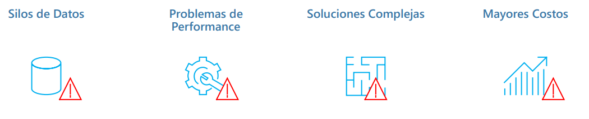

====================================
Arquitecturas de datos empresariales
====================================

   "A la mañana siguiente Nashe y Pozzi descubrieron que construir un muro no era tan sencillo como habían imaginado. Antes de empezar la construcción en sí había que hacer toda clase de preparativos. Había que trazar líneas, cavar zanjas, crear una superficie plana.

   –No podéis dejar caer las piedras simplemente y esperar que quede bien – les dijo Murks. Tenéis que hacer las cosas como Dios manda."

   -- La música del azar (Paul Auster, 1990).

Las Arquitecturas de datos Empresariales son los modelos, políticas, reglas y estándares que nos indican de qué manera tenemos que almacenar, organizar e integrar los datos que recoge una organización con el objetivo de que sean aprovechables y útiles. En la nueva era del Big Data, es de vital importancia para una empresa tener una arquitectura de datos centralizada, alineada con los procesos comerciales, que se adapta al crecimiento del negocio, y que evoluciona con los avances tecnológicos.

Desafios de las arquitecturas de datos Empresariales
----------------------------------------------------

Las arquitecturas de datos empresariales juegan un rol muy importante en las organizaciones. Sin embargo, la naturales de las 3Vs que vimos anteriormente pone en jaque a las arquitecturas en la ardua tarea de entregar el valor que el negocio espera:

   *Desafíos en una arquitectura de datos empresarial*

:Silos de datos: La mayoría de las organizaciones tradicionales preservaron la privacidad de los datos al mantener los datos específicos de la función en silos departamentales. En ese escenario, los datos utilizados por un departamento no estaban disponibles o accesibles para otro departamento. Sin embargo, eso causó un problema grave en el mundo de la analítica avanzada, donde los datos de clientes de 360 grados o los datos de marketing empresarial son necesidades cotidianas. Las organizaciones, independientemente de su tamaño, tipo o naturaleza del negocio, pronto se dieron cuenta de que para tener éxito en la era digital, los datos debían ser accesibles y compartibles.
:Performance: El valor de las arquitecturas de datos está en el volumen de los datos que procesan. Sin embargo, esto también puede convertirse en un problema importante. Si no diseñamos la arquitectura para escalar, esto puede convertirse en un problemas rápidamente - principalmente el escalamiento y la performance.
:Costos: Como consecuencia de una mala performance en el diseño de al arquitectura, los costos operativos pueden incrementarse rápidamente - y lo que es peor, no seguir un escalamiento lineal.
:Complejidad: Cada vez que trabajamos con diversas fuentes de datos, la complejidad del sistema es un desafío, sobre todo cuando ademas tenemos en cuenta a las diferentes velocidad en las que se mueven los datos.

Objetivos
---------

Idealmente, buscaremos diseñar una plataforma de procesamiento de datos que pueda entregar las siguientes cualidad:

.. figure:: _images/data-desires.png
   :alt: Objetivos en una arquitectura de datos empresarial
   :align: center

   *Objetivos en una arquitectura de datos empresarial*

.. note:: **TCO**, de la siglas *Total Cost of Ownership*, es la fórmula que nos permite evaluar los costes y beneficios directos e indirectos relacionados con la compra de cualquier componente técnilogico en su totalidad.

.. toctree::
    :maxdepth: 1
    :caption: En esta sección

    Organización y componentes <components/intro>
    cloud
    Arquitecturas estandar <architectures>