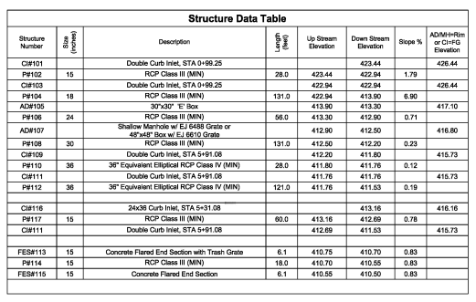
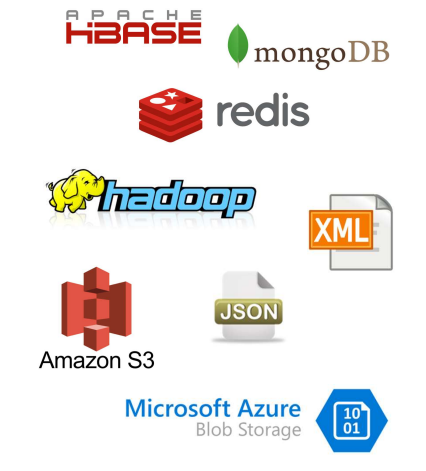
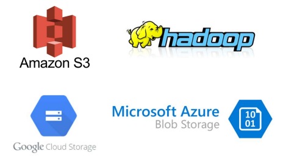

==============
Tipos de datos
==============

Dependiendo de su naturaleza, los actividos de datos digitales pueden clasificarse en estructurados, semi-estructurados y no estructurados.

Estructurados
-------------

El esquema de datos debe existir antes de que se creen instancias de datos. Por consiguiente, son datos que cumplen y conforman la especificación del esquema de datos.

   *Tipos de datos Estructurados.*

Características
^^^^^^^^^^^^^^^

:Fáciles de consultar, filtrar y ordenar: Agregar, eliminar y editar filas es sencillo. Mayoritariamente utilizando un lenguaje de consultas como T-SQL o utilizando librerías especificas como Pandas, Arrow, Numpy, etc. Adicionalmente, los motores de bases de datos utilizan técnicas como indexación, clusterización de índices y estadísticas de consultas que permiten la rápida resolución de las consultas. 
:Almacenamiento eficiente: RDBMS y OLAP utilizan técnicas de compresión de datos (llegando hasta 10 a 1). Replicación de datos mejoran la disponibilidad. Alta escalabilidad.
:Madurez: Esquemas de seguridad robustos.

Plataformas de almacenamiento
^^^^^^^^^^^^^^^^^^^^^^^^^^^^^

Incluyen:

* Bases de datos relacionales: (OLAP): Oracle, DB2, SQL Server, MySQL, PostgreSQL, Hive
* Data Warehouses (OLTP): Oracle, SQL Data Warehouse, Teradata, Snowflake
* Data Lake: Archivos de datos estructurados como Parquet.

   *Ejemplos de plataformas de almacenamiento de datos Estructurados.*

Semiestructurados
-----------------

El esquema de datos existe implícitamente en la instancia del dato, es decir, la instancia es auto-descriptiva. Incluso el esquema podría evolucionar y existir luego de que el dato existiera (esquema a posteriori).

   *Tipos de datos Semiestructurados.*

Características
^^^^^^^^^^^^^^^

:Facilidad para evolucionar el esquema: Al definir el esquema de datos de forma implícita, es relativamente sencillo evolucionar el esquema de datos a medida que los datos crecen. Sin embargo, es necesario un mínimo planeamiento de como si piensa evolucionar el esquema para evitar problemas cuando haya que hacerlo.
:Almacenamiento económico: Cuando se utiliza almacenamiento utilizando repositorios de objectos binarios (llamados BLOBs), el almacenamiento de grandes volúmenes de información es económico. Azure Blob Storage, Amazon S3 y Google Cloud Storage son almacenamientos de este tipo.
:Muchos lenguajes y librerías soportan consultas: Lenguajes como Spark-SQL soportan el descubrimiento dinámico del esquema de los objetos. Por ejemplo, utilizando la notación “punto”. Item.Fecha_de_nacimiento.

Plataformas de almacenamiento
^^^^^^^^^^^^^^^^^^^^^^^^^^^^^

Incluyen:

* Bases de datos no relacionales: (Document store): MongoDB, HBase, Redis.
* Data Lake: Archivos de datos semiestructurados como JSON, XML, Avro, Protobuf almacenados en Blob Storage, S3, HDFS.

   *Ejemplos de plataformas de almacenamiento de datos Semiestructurados.*

No-estructurados
----------------

No existe un esquema de datos que se deba conformar, o más bien, el esquema de datos coincide con el
esquema en que se almacenan. Ejemplos son archivos de imagen, texto, audio o video.

   *Tipos de datos No-estructurados.*

Características
^^^^^^^^^^^^^^^

:Pueden contener cualquier tipo de información: Una imagen puede ser una foto de un contrato, o una foto de un paisaje, o una evidencia forense, o...
:Su almacenamiento es económico, pero suelen ocupar mucho espacio: Cuando se utiliza almacenamiento utilizando repositorios de objectos binarios (llamados BLOBs), el almacenamiento de grandes volúmenes de información es económico. Azure Blob Storage, Amazon S3 y Google Cloud Storage son almacenamientos de este tipo.
:No son fáciles de consultar, filtrar y ordenar: Ejemplo, ¿cómo seleccionar todas las imágenes que tienen personas riendo?.

Plataformas de almacenamiento
^^^^^^^^^^^^^^^^^^^^^^^^^^^^^

Incluyen:

* Data Lake: Azure Blob Storage, AWS S3, HDFS, GCP Cloud Storage.
* En campos de otros tipos de datos: Columnas de una tabla en una base de datos, en una propiedad de un
archivo JSON.

   *Ejemplos de plataformas de almacenamiento de datos No-estructurados.*

