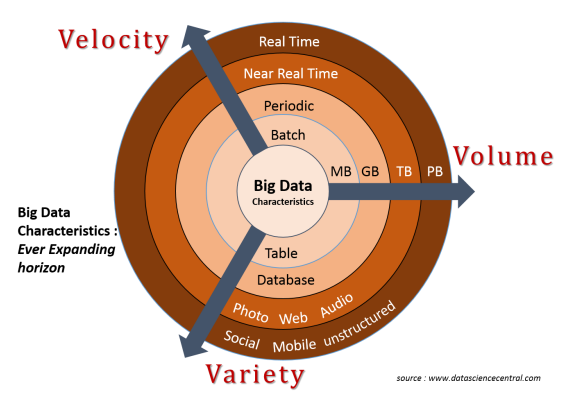
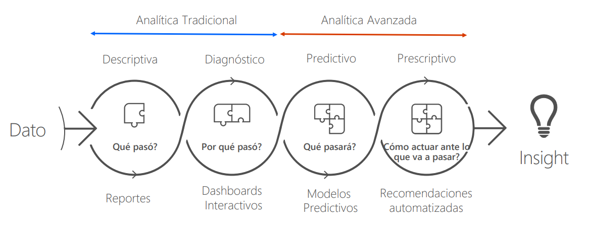

Introducción a las arquitecturas de datos
=========================================

Las arquitecturas de datos son un elemento fundamental en aquellas organizaciones con una estrategia basada en información. Las mismas establecen las formas en las que se capturaran (o generarán), procesaran, almacenaran e utilizarán los datos, y cómo se podrá acceder a los mismos. 

Rol de las arquitecturas de datos
---------------------------------

Sin duda, el crecimiento exponencial de los datos y su rol estratégico en la toma de decisiones han desafiado las capacidades de procesamiento y almacenamiento de los sistemas de información modernos, especialmente en la última década. La capacidad de manejar y gestionar grandes volúmenes de datos se ha convertido gradualmente en una capacidad fundamental de las :doc:`../arch/intro`. 

Desafios actuales
-----------------

Volumen, Variedad y Velocidad
^^^^^^^^^^^^^^^^^^^^^^^^^^^^^
Las definiciones teóricas de qué es "Big Data" y cómo pueden ser utilizadas por organizaciones y empresas ha sido objeto de debate (Jacobs, 2009). En ese aspecto, el marco de las 3V (ver imágen mas adelante) ha ganado una atención considerable desde que fue presentado por Laney (Laney, 2001). En esa representación "Big Data" se puede definir por tres características distintivas: Volumen, Variedad y Velocidad.

   *Volumen, Variedad y Velocidad.*

El **volumen** representa la cantidad - cada vez mayor - de datos que se generan y que se ponen a disposición de las organizaciones, ya sea de forma intencional o no. Por otro lado aunque relacionado, existe un crecimiento en la **variedad** de datos producidos como consecuencia de la multitud de fuentes (sensores, dispositivos inteligentes, redes sociales, telemetría, etc). Esta variedad incluye datos sin procesar, semiestructurados y no estructurados lo que complica aún más el procesamiento y el almacenamiento de datos. Finalmente, el aspecto de **velocidad** (:doc:`velocity`) describe qué tan rápido se recuperan, almacenan y procesan los datos. 

La combinación de estas tres **V's** representan un nuevo desafío para las arquitecturas de datos empresariales actual. Lidiar con formatos de datos definidos de manera imprecisa, tamaños de datos cada vez mayores y requisitos con tiempos de procesamiento variables ponen en jaque las capacidades técnologicas de las organizaciones al punto de que dejarlas fuera del juego.

Variabilidad y la Veracidad
^^^^^^^^^^^^^^^^^^^^^^^^^^^
Desde la perspectiva del procesamiento de la información, las tres características *Volumen, Variedad y Velocidad* juntas describen con precisión qué es Big Data. No obstante, además de las 3V, que describen la característica cuantitativa de los sistemas de Big Data, existen características cualitativas adicionales como la Variabilidad y la Veracidad. 

El aspecto **Variabilidad** define las diferentes interpretaciones que pueden tener ciertos datos cuando se ponen en diferentes contextos. Se centra en la semántica de los datos, en lugar de su variedad en términos de estructura o representación. El aspecto **Veracidad** define la precisión de los datos o qué tan veraces son. Si los datos están corruptos, son imprecisos o inciertos, esto tiene un impacto directo en la calidad de los resultados finales. **Tanto la variabilidad como la veracidad tienen influencia directa en el valor cualitativo de los datos procesados**. El valor real obtenido del análisis de datos, también llamado *data insights*, es otra medida cualitativa que no es posible definir de forma precisa y determinista. 

Costos
^^^^^^
Mientras que el modelo 3V proporciona un marco intuitivo, esta representación de los procesos de datos puede dar lugar a errores en el diseño de plataformas Big Data que hagan que las arquitecturas de datos se vuelvan insostenibles en el tiempo. Una cuestión particular que debe tenerse en cuenta es el factor de costo que se deriva de la utilización del modelo 3V. 

Los requerimientos de negocio en diferentes organizaciones e incluso en diferentes sectores de la misma organización no son los mismos. Alcanzar un determinado nivel en caulquiera de las Vs tiene asociado un costo. Es importante abordar y entender los mismos para lograr saturar la infraestructura existente considerando los factores de costo asociados con el mantenimiento de los sistemas que soportan la arquitectura de datos.

Organizaciones impulsadas por datos
-----------------------------------

Las organizaciones impulsadas por datos innovan y transforman su negocio al combinar y democratizar los datos con técnicas de análitica avanzada, aplicaciones modernas, computación en la nube y desarrollo ágil para brindar mayor valor a sus clientes. Estas organizaciones tienen una estrategia de negocio que que grabita alrededor de los datos que generan, capturan y procesan; fomentando el crecimiento a través de la innovación, la velocidad de comercialización y la rentabilidad.

Esta estrategia, sin embargo, tiene un costo. Requiere poder evolucionar los datos para soportar escenarios de análitica que van más alla de simples calculos estadísticos.

   *De análitica tradicional a analítica avanzada.*

:Analítica tradicional: En el analisis de datos tradicional, los datos se procesan para proporcionar informacion relacionada con el rendimiento pasado de las operaciones empresariales. Los datos se recopilan y se formatean con fines de presentacion de informes, y los usuarios y/o los encargados de tomar decisiones obtienen informacion despues de la interpretacion.
:Analítica avanzada: La analítica avanzada emplea modelos predictivos, métodos estadísticos, aprendizaje automático y técnicas de automatización de procesos (Ops) más allá de las capacidades de las herramientas tradicionales de inteligencia de negocio (BI) para analizar datos o información en las organizaciones.

.. toctree::
    :maxdepth: 2
    :caption: En esta sección

    lifecycle
    velocity

