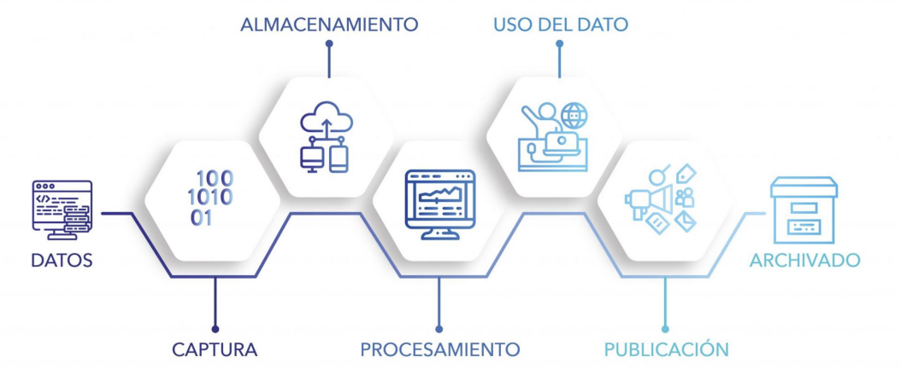
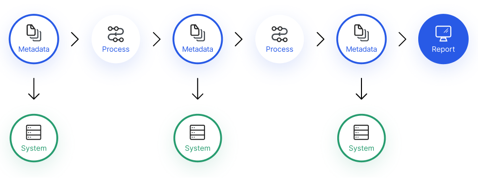

==========================
Ciclo de vida de los datos
==========================

En el momento que una organización identifica al dato como un activo de valor, el siguiente paso es la gestión de dicho activo de forma precisa. Para ello, es necesario poder conocer y asociar a cada dato con un ciclo de vida del activo. Este ciclo trata de conocer todo lo que ocurre con el dato: desde como se crea o incorpora a un proceso, hasta el descarte final o publicación.

.. note:: Entendemos como ciclo de vida de un activo a las diferentes etapas por las que pasa un activo desde su nacimiento hasta su decomisación.

Fases del ciclo de vida de los datos
------------------------------------

Para que las organizaciones puedan materializar el valor de los datos, es necesario que las mismas los evolucionen a lo largo de las fases del ciclo de vida. Cada una de estas fases tiene sus propias características:

   *Ciclo de vida del dato.*

Captura
^^^^^^^

La primera fase en el ciclo de vida de los datos comienza con su creación, en donde el dato es instanciado dentro de la :doc:`../arch/intro` de la organización. En general nos referiremos a este proceso como **captura** para abstraernos del método con el cual las instancia de datos efectivamente se generan, incluyendo:

:Ingesta: Hace referencia a la integración de datos provenientes de sistemas existentes en la organización. Estos datos en general son duplicados.
:Creación: Hace referencia a la generación (manual o automática) de datos especificos para un propósito. Por ejemplo, la generación de una encuesta de satisfacción a todos los clientes.
:Adquisición: Hace referencia a la integración de datos externos a la organización que son adquiridos a proveedores con el objetivo de expandir nuestro entendimiento sobre algún dominio en particular.

Cada método supone importantes retos. Por ejemplo, la adquisición de datos suele implicar la creación de contratos o normas uqe definen la forma en que la organización hace uso de los datos del exterior. La creación de datos implica un detallado control de seguridad para asegurarse que solo procesos válidos están generando datos. En el caso de ingesta, desafíos como la velocidad y mantenimiento de los procesos que mueven datos de un origen a otro suponen una arquitectura de datos que lo soporte.

En las seccion :doc:`../arch/components/ingest` veremos las diferentes piezas de la :doc:`../arch/intro` que son utilizadas en esta fase.

Almacenamiento
^^^^^^^^^^^^^^

Una vez que el dato fué capturado, debemos almacenar los mismos en un sistema que pueda disponibilizar su consumo. El sistema de almacenamiento también definirá las políticas de acceso a los mismos y los requerimientos de seguridad necesarios. Estos últimos en general suelen depender de la industria en donde la organización opera, el marco regulatorio del pais y leyes o tratados que limiten la forma en que se almacenan datos.

En las seccion :doc:`../arch/components/store` veremos las diferentes piezas de la :doc:`../arch/intro` que son utilizadas en esta fase, dependiendo de los :doc:`data-types` de los activos.

Procesamiento
^^^^^^^^^^^^^

Esta es la fase en donde se realizan transformaciones sobre los datos para agregar valor o para integrarlos con otros datos. 

En las seccion :doc:`../arch/components/process` veremos las diferentes piezas de la :doc:`../arch/intro` que son utilizadas en esta fase, dependiendo de los :doc:`data-types` de los activos y de las :doc:`velocity` que el caso de negocio demanda.

En general encontraremos dos actividades:

Mantenimiento
~~~~~~~~~~~~~
El objetivo de esta fase es procesar el dato, pero sin que genere aún un valor claro para la organización. Este procesamiento incluye tareas de integración, limpieza, enriquecimiento, así como proceso de extracción, transformación y carga del dato (ETL).

.. important:: El mantenimiento del dato podría darse de forma reiterada a lo largo del tiempo ya que involucra mantener el valor del activo durante todo su ciclo de vida. Por ejemplo, considere el caso donde los códigos de clientes evolucionaron de un sistema a otro.

Sintesis
~~~~~~~~
Esta fase consiste en la creación de datos de valor aplicando un procesamiento o lógica determinada, usando otros datos como fuente. Esta es el área del procesamiento analítico donde se usa el modelo de datos.

Uso del dato
^^^^^^^^^^^^

En la fase de uso del ciclo de vida de los datos, la información es la base para la toma de decisiones. Los usuarios pueden recuperar datos, procesarlos, e integrarlos a otras aplicaciones. El uso del dato incluye desafíos importantes como es el uso légitimo o no de los datos dentro del contexto de negocio que el usuario pretende.

Publicación
^^^^^^^^^^^

La publicación de los datos incluye el envío de los mismos a sistemas externos, dentro o fuera de la organización. Un ejemplo es una agencia de inversiones que envía infromes mensuales a sus clientes con recomendaciones de operaciones.

La diferencia fundamental entre el **Uso del dato** y su **Publicación** es que una vez que ha sido publicado, los datos no pueden ser recuperados para una modificación (o al menos no es una operación trivial). 

En las seccion :doc:`../arch/components/consume` veremos las diferentes piezas de la :doc:`../arch/intro` que son utilizadas en esta fase.

Archivado
^^^^^^^^^

El archivado incluye copiar los datos a un entorno donde son almacenados en caso de que se los vuelva a necesitar, junto con la completa eliminación de los mismos en el entorno activo. Los datos que son archivados son almacenados, pero en general no son mantenidos. 

.. note:: Regulaciones en varios territorios pueden exigir a las organizaciones retener determinados tipos de datos a pesar de que la organización ya no quiera hacer uso de los mismos.

Eliminación
~~~~~~~~~~~
En general, como parte final del proceso de archivado, el dato alcanza su etapa final, la cual consiste en la destrucción de cualquier copia del dato que exista dentro de la organización. La eliminación de los datos representa una operación importante en organizaciones reguladas y sobre todo en aquellas que mantienen información personal identificatoria (PII). Regulaciones en varios territorios pueden exigir a las organizaciones demostrar la completa eliminación de estos registros cuando se alcanzan determinadas condiciones.

Linaje del dato
---------------

Los activos digitales, a diferencia de los activos físicos, tienen la capacidad de ser duplicados y distribuidos rápidamente. Esto, combinado con el hecho de que el dato no es un activo estático durante su ciclo de vida, genera desafios a la hora de mantener un registro de como los mismos se mueven y se utilizan dentro de la organización.

   *Los datos se transforman y evolucionan en el sistema. El lineaje permite detectar que transformaciones sufrió el dato y porque se dieron.*

El linaje de los datos propone métodos para mantener la trazabiliadd de los datos, conociendo todas las transformaciones que el mismo ha sufrido desde el momento que es creado hasta que es destruido. El linaje le permite a la organización rastrear e identificar errores, aplicar protocolos más rigurosos de :doc:`../governance/data`, reducción de risgos y asegurar su protección.

.. important:: El linaje del dato es un paso necesario, pero no suficiente, hacia la gestión eficiente del dato. En general, esto forma parte de un concepto mas amplio abordado en Gobierno de datos.
