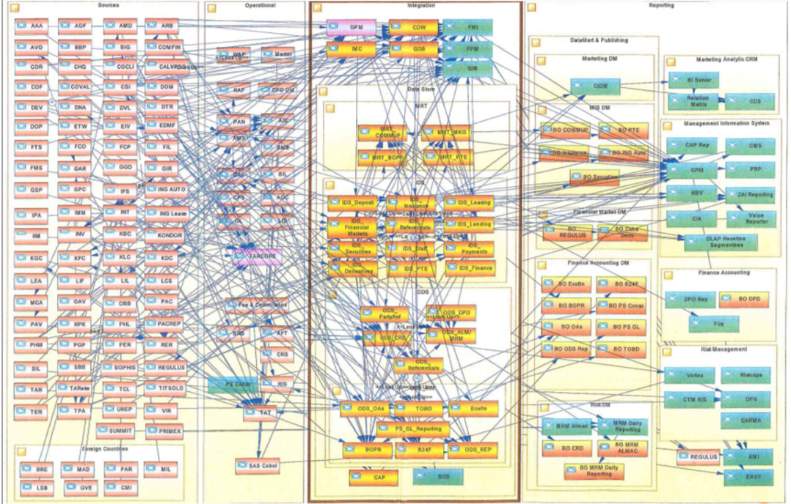
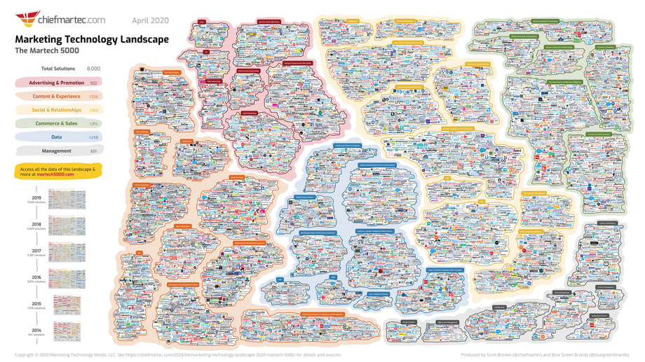

====================
El gobierno de datos
====================

Definiremos el gobierno de datos como un conjunto de controles, políticas y procedimientos que habilita a una organización a asegurar la existencia de datos de alta cálidad durante todo el ciclo de los datos que soportan los objetivos de negocio. Existen 5 áreas claves en los que se focaliza el gobierno de datos incluyendo disponibilidad, usabilidad, consistencia, integridad y seguridad.

Porqué es necesario
-------------------

La calidad de los datos
^^^^^^^^^^^^^^^^^^^^^^^

Según `un informe patrocinado por Profisee de Harvard Business Review Analytics Services<https://profisee.com/harvard-survey-on-trustworthy-data/>`_, el 67 % de los encuestados dice que el gobierno de datos es importante para lograr datos de alta calidad. Considerando que las tendencias tecnológicas tales como el aprendizaje automático y la inteligencia artificial dependen de datos de calidad, sumado al impulso de las iniciativas de transformación digital en todo el mundo, el gobierno de datos se ha vuelto un factor fundamental para poder materializar las oportunidades que los datos ofrecen.

Complejidad de los sistemas modernos
^^^^^^^^^^^^^^^^^^^^^^^^^^^^^^^^^^^^

Un flujo de datos no controlado entre los sistemas de procesamiento de transacciones puede paralizar la capacidad de responder al cambio y limitar a la organización en el mediano y largo plazo.

   *Diagrama ejemplo de la complejidad de un solo proceso en un país. Origen: The Journey Continues - From Data Lake to Data-Driven Organization.*

Sumada a la complejidad de los procesos, la cantidad de aplicaciones que las organización despliegan en la actualidad y que por consiguiente deben administrar también está aumentando.

   *Diagrama de aplicaciones de marketing en la actualidad (2020).*

Multiplicidad de los origines de datos
^^^^^^^^^^^^^^^^^^^^^^^^^^^^^^^^^^^^^^

Leyes de protección de datos
^^^^^^^^^^^^^^^^^^^^^^^^^^^^

Las empresas ahora deben proteger la información de identificación personal (PII).

:California (Estados Unidos): Recientemente promulgada como ley, la Ley de Privacidad del Consumidor de California (California Consumer Privacy Act) otorga a los residentes de California nuevos derechos con respecto a la recopilación de su información personal.
:Europa: El Reglamento General de Protección de Datos (GDPR) es la ley de privacidad y seguridad más rigurosa actualmente en vigor y se aplica a cualquier empresa que recopile datos de personas en la UE.
:Canada: La Ley de Protección de Información Personal y Documentos Electrónicos (PIPEDA) rige para que las organizaciones del sector privado recopilen, usen y divulguen información personal en Canadá.

Versionamiento
--------------

Como mencionamos, los sistemas basados en aprendizaje automático son una combinación de datos y código:

.. math::

   Sistemas\; de\; AA = codigo + datos

De igual forma que la ingeniería de software necesita versionar el código en las iteraciones para asegurar un control de cambios, en nuestros proyectos basados en datos deberemos de proveer los mísmos mecanismos para los datos.

Herramientas como `Git <https://en.wikipedia.org/wiki/Git>`_ son ampliamente utilizadas a la hora de mantener un control de cambios en un repositorio de código y podría decirse que hoy es un estandar. Sin embargo, Git realiza comparaciones linea a linea para identificar los cambios en versiones, y por lo tanto no resulta apropiado para realizar versionamiento de conjuntos de datos y las organizaciones suelen descansar en mecanismos especificos dependiendo de la infraestructura disponible. Estos métodos pueden ir desde versionamientos manuales utilizando estructuras de carpetas, hasta técnologias avanzadas como `Delta Time Travel <https://databricks.com/blog/2019/02/04/introducing-delta-time-travel-for-large-scale-data-lakes.html>`_. Independientemente de lo que la organización tenga disponible, es importante poder mantener una práctica de versionamiento de los conjuntos de datos lo cual nos permita que nuestros experimentos sean repetibles. Es más, esto puede ser un requerimiento de :doc:`../../develop/ops/validation/auditing` del cual no podamos escapar.

.. toctree::
    :maxdepth: 1
    :caption: En esta sección
 
    security