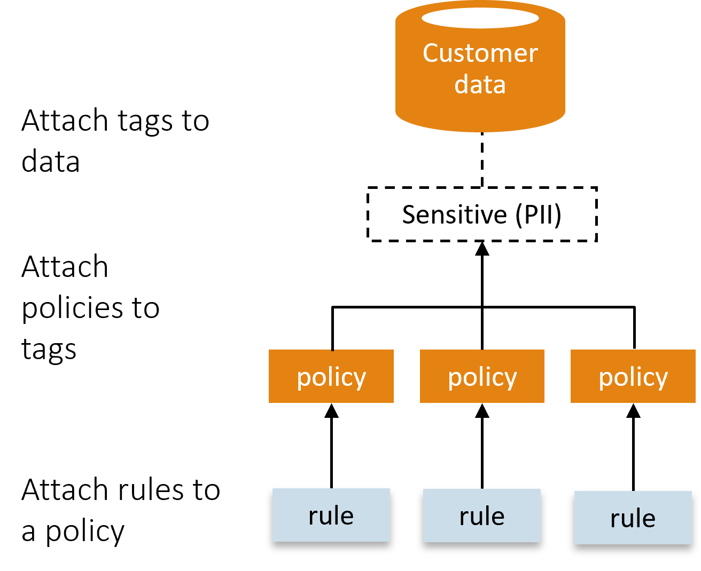

======================
Clasificación de datos
======================

Esquemas de clasificación de confidencialidad

.. csv-table:: Esquemas de clasificación de confidencialidad
   :header: "Confidencialidad", "Descripción"
   :widths: 20, 50

   "Público", "Cualquiera puede acceder, se puede enviar a cualquier persona, p.e. datos abiertos de un gobierno."
   "Uso interno", "Los empleados unicamente pueden accederlos. No se puede enviar fuera de la organización."
   "Confidencial", "Debe compartirse solo si es necesario para una tarea específica. No puede enviarse fuera de la empresa sin un acuerdo de confidencialidad."
   "Sensibles (PII) Personally identifiable information", "Debe ocultarse y compartirse solo cuando sea necesario por un tiempo limitado. No se puede enviar a personal no autorizado o fuera de la organización."
   "Restringido", "Solo para ser compartido con personas designadas que son responsables de su protección, p. documentos legales, secreto comercial (receta de Coca Cola)."

Esquemas de clasificación de retención

.. csv-table:: Esquemas de clasificación de retención
   :header: "Retención", "Descripción"
   :widths: 20, 50

   "Ninguna", "No se requiere retener los datos."
   "Temporario", "Se retienen, aunque por poco tiempo. p.e. datos de cuentas de Twitter que se retienen por semanas."
   "Tiempo fijo", "Se determina el numero de años por los cuales se deben retener los datos."
   "Permanente", "No deben ser eliminados nunca. Por ejemplo, correspondencia legal."

Relevancia en el procesos de creación de políticas de gobierno de datos
-----------------------------------------------------------------------

Las políticas de gobierno de datos describen un conjunto de reglas para controlar la integridad, la calidad, la seguridad de acceso, la privacidad y la retención de datos.
Tipos de políticas de gobierno de datos. Las politicas incluyen:

* Políticas de integridad de datos: valores válidos, integridad referencial
* Políticas de calidad de datos: Reglas de estandarización de datos, reglas de limpieza de datos, reglas de coincidencia e integración de datos.
* Políticas de seguridad de acceso a datos: seguridad, acceso y aprovisionamiento.
* Políticas de privacidad de datos
* Políticas de retención de datos: Reglas de retención de datos, reglas de copia de seguridad y archivo de datos.

Es posible que se necesiten múltiples versiones de políticas en diferentes jurisdicciones.

   *Las politicas se aplican de acuerdo a como están clasificados los datos.*