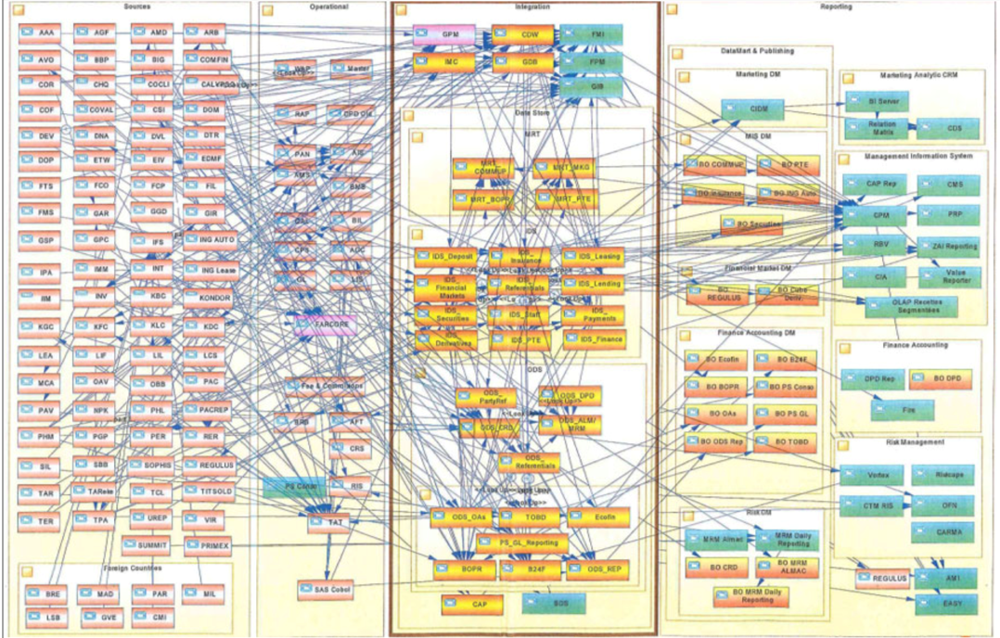
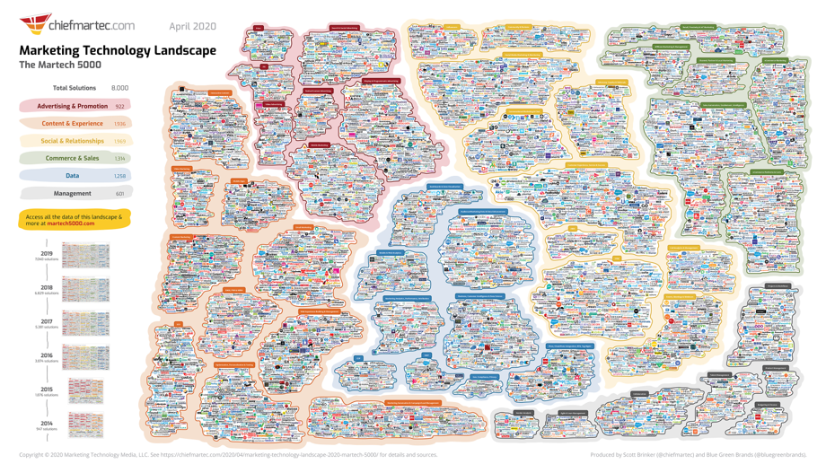

====================
El gobierno de datos
====================

Definiremos el gobierno de datos como un conjunto de controles, políticas y procedimientos que habilita a una organización a asegurar la existencia de datos de alta cálidad durante todo el ciclo de los datos que soportan los objetivos de negocio. Existen 5 áreas claves en los que se focaliza el gobierno de datos incluyendo disponibilidad, usabilidad, consistencia, integridad y seguridad.

Porqué es necesario
-------------------

La calidad de los datos
^^^^^^^^^^^^^^^^^^^^^^^

Según `un informe patrocinado por Profisee de Harvard Business Review Analytics Services <https://profisee.com/harvard-survey-on-trustworthy-data/>`_, el 67 % de los encuestados dice que el gobierno de datos es importante para lograr datos de alta calidad. Considerando que las tendencias tecnológicas tales como el aprendizaje automático y la inteligencia artificial dependen de datos de calidad, sumado al impulso de las iniciativas de transformación digital en todo el mundo, el gobierno de datos se ha vuelto un factor fundamental para poder materializar las oportunidades que los datos ofrecen.

Complejidad de los sistemas modernos
^^^^^^^^^^^^^^^^^^^^^^^^^^^^^^^^^^^^

Un flujo de datos no controlado entre los sistemas de procesamiento de transacciones puede paralizar la capacidad de responder al cambio y limitar a la organización en el mediano y largo plazo.

   *Diagrama ejemplo de la complejidad de un solo proceso en un país. Origen: The Journey Continues - From Data Lake to Data-Driven Organization.*

Sumada a la complejidad de los procesos, la cantidad de aplicaciones que las organización despliegan en la actualidad y que por consiguiente deben administrar también está aumentando.

   *Diagrama de aplicaciones de marketing en la actualidad (2020).*

Multiplicidad de los origines de datos
^^^^^^^^^^^^^^^^^^^^^^^^^^^^^^^^^^^^^^

Leyes de protección de datos
^^^^^^^^^^^^^^^^^^^^^^^^^^^^

Las empresas ahora deben proteger la información de identificación personal (PII).

:California (Estados Unidos): Recientemente promulgada como ley, la Ley de Privacidad del Consumidor de California (California Consumer Privacy Act) otorga a los residentes de California nuevos derechos con respecto a la recopilación de su información personal.
:Europa: El Reglamento General de Protección de Datos (GDPR) es la ley de privacidad y seguridad más rigurosa actualmente en vigor y se aplica a cualquier empresa que recopile datos de personas en la Union Europea.
:Canada: La Ley de Protección de Información Personal y Documentos Electrónicos (PIPEDA) rige para que las organizaciones del sector privado recopilen, usen y divulguen información personal en Canadá.

Reputación de la organización
^^^^^^^^^^^^^^^^^^^^^^^^^^^^^

   *Un incorrecto gobierno de datos pueden dar lugar a filtraciones de datos que dañen la reputación de la organización.*

Requerimientos para un gobierno de datos
----------------------------------------

* Definición de datos y entidades: creación de un vocabulario empresarial común en un glosario empresarial
* Identificación/descubrimiento de datos y entidades de datos
* Clasificación de gobierno de datos
* Personas: propiedad de los datos, administración y responsabilidad de la gobernanza
* Procesos: para gobernar los datos
* Políticas y reglas para definir cómo se deben gobernar los datos a lo largo del ciclo de vida de los datos
* Cumplimiento de políticas en todo el panorama de datos distribuidos
* Gestión de datos maestros para obtener coherencia entre los sistemas, p. cliente, producto, proveedor
* Linaje de metadatos
* Tecnología: para hacerlo posible en el centro de datos, la nube y el perímetro

¿Qué necesitamos definir para comenzar a gobernar los datos?
------------------------------------------------------------

* ¿Qué datos existen y dónde están?
* ¿Cuantas copias existen?
* ¿Qué datos necesitan ser gobernados y gestionados?
* ¿Cómo debería clasificarse, p. ¿Son datos confidenciales como PII, es un secreto comercial?
* Si los datos están estructurados, ¿por qué nombres de datos se conocen y hay nombres de datos comunes por los que deberían ser conocidos?
* ¿Qué tan buena o mala es la calidad de los datos?
* ¿Necesita ser limpiado, transformado, integrado y compartido?
* ¿Quién es responsable de hacer ese trabajo?
* ¿Qué datos confiables están disponibles y cómo se produjeron?
* Si los datos cambian, ¿debería mantenerse sincronizado?
* ¿Quién puede acceder y modificar los datos maestros?
* ¿Cuánto poder tienen los usuarios y cómo se auditan los usuarios, las aplicaciones y los scripts?

.. toctree::
    :maxdepth: 1
    :caption: En esta sección
 
    security