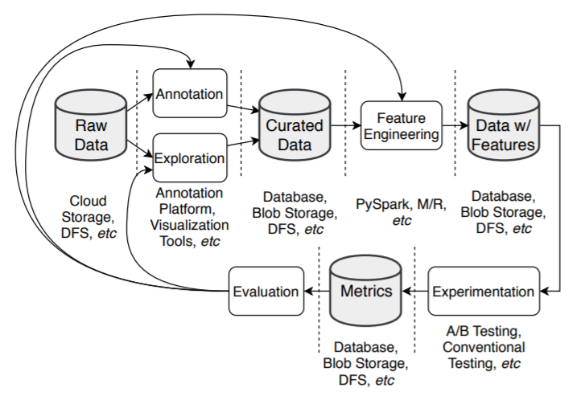

.. _rst_data_adquisition:

====================
Adquisición de datos
====================

Una vez que tenemos el problema de negocio definido, una pregunta que nos podemos hacer es *¿Disponemos de los datos para resolver el problema?* O más aún *¿cuales son los datos que necesitaría para resolver el problema? ¿Qué calidad necesitamos que tengan?*. Estas preguntas no solo alcanzan al diseño del modelo sino que también a su puesta en producción: *¿Disponémos de los recursos para implementar los flujos de datos en producción? ¿Con que frecuencia necesitaré disponer de una nueva versión del conjunto de datos? ¿Cual es el costo total de mantener estos flujos de datos funcionando?*

El proceso de adquisición de datos puede parecer sencillo al principio, pero en implementaciones más grandes o en organizaciones que utilizan técnicas de aprendizaje automático de forma prevasiva, pueden resultar similar al siguiente gráfico:

   *Flujo de datos en un proceso de aprendizaje automático. Fuente:* `Data Platform for Machine Learning, Apple, 2019 <https://dl.acm.org/doi/pdf/10.1145/3299869.3314050>`_ 

.. _rst_data_adquire_ingest_generate:

Ingestar, adquirir o generar
----------------------------

El concepto de adquisición de datos puede tomar muchas formas dependiendo del contexto, el objetivo de la organización y la importancia del proyecto. Aquellas organizaciones que se centran en los datos justamente se permiten explotar esta fase al máximo. 

Ingestar
^^^^^^^^
En muchos casos la organización ya dispone de la información necesaria para entrenar el modelo. Sin embargo, es necesario implementar procesos de ingesta de datos que nos permitan extraer la información desde los origenes de los datos en los que se encuentran y depositarlos en algún repositorio donde podamos retenerla. Es importante extraer la información de su repositorio original en aquellos casos donde el repositorio por ejemplo es un sistema transaccional o un sistema OLAP que evoluciona en el tiempo. 

.. warning:: Durante el proceso de experimentación, el conjunto de datos debe mantenerse estático para que podamos obtener resultados repetibles.

Adquirir
^^^^^^^^
En otros casos puede ser que la organización no disponga de toda la información necesaria, y por ejemplo, deba adquirirla. Esta adquisición puede ser o bien a traves de un tercero, como por ejemplo la subscripción a un servicio de imágenes satelitáles, o también a traves de sus propios medios. Por ejemplo, es posible que para entrenar un modelo de detección de defectos en planchas de métal en una industría siderurgica debamos de generar un conjunto de datos con imagenes tomadas de diferentes defectos para poder clasificarlas. Esta adquisición tendrá un costo para la organización, es importante poder cuantificarlo.

Generar
^^^^^^^
Existen problemas donde disponer de un conjunto de datos más rico que quizás ofrecería una performance mejor. Por ejemplo, en el caso anterior de un modelo de detección de defectos en planchas de metal, disponer de las mismas fotografías tomadas de diferentes ángulos, en diferentes tamaños, podría hacer que el modelo desarrolle mayor robustes para detectarlas en diferentes configuraciones. Esta técnica se la conoce como *data augmentation* y es un caso especial de la generación sintética de datos.

La generación sintética de datos nos permite generar nuevas instancias de datos a partir de datos pre-existentes, o, porque no, a partir de reglas de generación que definamos.

Por qué es importante focalizarse en los datos
----------------------------------------------

Existen varias formas de evolucionar o mejorar la performance de un modelo de aprendizaje automática (teoricamente). Una estrategia es evolucionar el modelo o su arquitectura. Esto quiere decir, probar nuevas arquitecturas (en general más grandes o más complejas), nuevas configuraciones, nuevos conjuntos de parámetros, etc. A esta estrategía, donde básicamente mantenemos los datos estáticos e introducimos modificaciones iterativamente sobre el código, se la conoce como *model-centric*.

Sin embargo, en la práctica vemos que aquellos modelos que utilizan la mayor cantidad y calidad de datos posible en general consiguen mejoras de performance mucho mas notables que si invirtieran la misma cantidad de tiempo en evoluacionar la arquitectura del modelo. Esta realidad hace que muchos equipos de desarrollo se focalizen en la mejora continua de sus datos, es decir en una estrategia *data-centric*. Aquellas organizaciones que toman esta iniciativa en general la desarrollan junto a una política de adquisición de datos que les permite tener **intención** sobre la información que almacenan.

Conjunto de datos vs anotaciones
--------------------------------
En algunos casos, puede resultar útil diferenciar entre *conjuntos de datos* y *conjuntos de anotaciones*. Los conjuntos de datos son colecciones de entidades, telemetría o cualquier información que será utilizada para entrenar nuestros modelos de aprendizaje automático. Los *conjuntos de anotaciones*, por el otro lado, son los valores de las etiquetas o incluso otras características que fueron extraidas de los mismos datos. Claramente las anotaciones siempre están asociados con un conjunto de datos, pero esta distinción nos da una ventaja. En primer lugar, le permite a multiples proyectos y equipos etiquetar los datos de forma distinta. Más aún, dado que las anotaciones son información extra sobre las entidades, esta información puede evolucionar multiples veces sin necesidad de evolucionar el conjunto de datos. 

.. note:: Esta distinción no siempre suele realizarse, y dependerá de la implementación que la organización haya realizado de la plataforma de analítica avanzada.

Muchas veces esto puede ser incluso un requerimiento. La organización podría tener que auditar y controlar la evolución de algunos conjuntos de datos debido a regulaciones y cumplimiento. Al tener un solo conjunto de datos, las restricciones se imponen sobre el conjunto de datos independientemente de como cada equipo realiza las anotaciones.

Versionamiento
--------------

Como mencionamos, los sistemas basados en aprendizaje automático son una combinación de datos y código:

.. math::

   Sistemas\; de\; AA = codigo + datos

De igual forma que la ingeniería de software necesita versionar el código en las iteraciones para asegurar un control de cambios, en nuestros proyectos basados en datos deberemos de proveer los mísmos mecanismos para los datos.

Herramientas como `Git <https://en.wikipedia.org/wiki/Git>`_ son ampliamente utilizadas a la hora de mantener un control de cambios en un repositorio de código y podría decirse que hoy es un estandar. Sin embargo, Git realiza comparaciones linea a linea para identificar los cambios en versiones, y por lo tanto no resulta apropiado para realizar versionamiento de conjuntos de datos y las organizaciones suelen descansar en mecanismos especificos dependiendo de la infraestructura disponible. Estos métodos pueden ir desde versionamientos manuales utilizando estructuras de carpetas, hasta técnologias avanzadas como `Delta Time Travel <https://databricks.com/blog/2019/02/04/introducing-delta-time-travel-for-large-scale-data-lakes.html>`_. Independientemente de lo que la organización tenga disponible, es importante poder mantener una práctica de versionamiento de los conjuntos de datos lo cual nos permita que nuestros experimentos sean repetibles. Es más, esto puede ser un requerimiento de :doc:`../ops/validation/auditing` del cual no podamos escapar.
