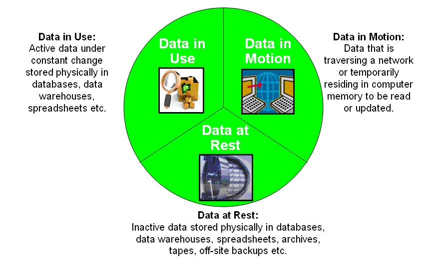

.. _rst_data_adquisition:

====================
Adquisición de datos
====================
TODO

Versionamiento
--------------
Herramientas como Git son ampliamente utilizadas a la hora de mantener un control de cambios en un repositorio de código. Sin embargo, git realiza comparaciones linea a linea, y por lo tanto no resulta apropiado para realizar versionamiento de conjuntos de datos.

Anonimización y emascaramiento
------------------------------
El *enmascaramiento*, también conocido como *ofuscamiento*, *anonimización* o *pseudonimización*, hace referencia al proceso por el cual aquella información clasificada como confidencial es ocultada a quien la consume mediante su remplazo por otros valores de datos o incluso caracteres especiales. Cuando trabajamos con datos que incluyen información sensible o regulada por la industria, los procesos de adquisición de datos deberán tener en cuenta la protección de esta información no solo para los diferentes roles que están involucrados en el ciclo de desarrollo del modelo sino que también durante el tránsito de la información (*data in motion*) y durante su almacenamiento (*data at rest*).

   Origen: Wikipedia

Quizás una de las tareas más complejas asociadas con la anonimización es el descubrimiento de la información sensible antes de que los usuarios tengan acceso a la misma. Existen herramientas en el mercado capaces de descubrir esta información dentro de los repositorios de la organización y disponibilizar mecanismos de enmascaramiento para protegerla.

Tipos de enmascaramientos
^^^^^^^^^^^^^^^^^^^^^^^^^

Existen diferentes tipos de enmascaramiento:

:Estático (SDM - Static Data Masking): En esta configuración, la información sensible se encuenra en el repositorio de datos original pero luego es enmascarada en una copia ubicada en un ambientes de destino que la organización puede compartir con los actores que lo requieren.
:Dinámica (DDM - Dynamic Data Masking): En esta configuración, no hay necesidad de duplicar el repositorio de datos ya que la información sensible permanece en el repositorio original pero es *dinámicamente* enmascarada al momento de ser consumida por los actores que lo requieren.

.. note:: El enmascaramiento de información es una forma de proteger información sensible, aunque podría no ser suficiente para evitar que un usuario mal intencionado tenga acceso a los valores reales de las instancias de datos. Por ejemplo, un usuario podría utilizar lógica para deducir los valores de los campos que han sido enmascarados, sobre todo cuando estos usuarios tienen conocimiento de alguna de las instancias de datos. La propiedad que asegura que un conjunto de datos no revelará información sensible ante un usuario se conoce como `private differenciable` y comprende un ámbito más grande que el del enmascaramiento de información.

Técnicas de enmascaramiento
^^^^^^^^^^^^^^^^^^^^^^^^^^^

Dependiendo de los requerimientos de la organización y el tipo de análisis de datos que se va a realizar a posteriori, existen multiples técnicas para el enmascaramiento de datos. En lo que nos respecta al alcance de este curso, nos interesa indentificar que técnicas de enmascaramiento funcionarán de mejor manera con nuestros modelos de aprendizaje automático.

Podemos diferenciar técnicas *deterministas*, es decir, técnicas que producen el mismo resultado para la misma pieza de información, y técnicas *no deterministas* donde existe una naturaleza estocástica. La propiedad que mayormente nos interesará es la de obtener un conjnuto de datos que mantenga la misma distribución de los datos originales y esto lo podemos alcanzar con técnicas tanto determinstas como no deterministas, dependiendo de como se implemente cada una.

Adicionalmente, las técnicas pueden ser reversibles o irreversibles significando si es posible o no volver a obtener el dato original desde una pieza de información que fué enmascarada. En general, preferiremos métodos que sean irreversibles ya que nos aseguran que no sera posible volver a generar el dato original.

* Sustitución: Como el nombre lo sugiere, esta técnica consiste en remplazar la información original con datos que son o bien aleatórios o provenientes de una lista predefinida. La sustitución del dato puede ser total o parcial, siendo esta ultima muy utilizada por ejemplo en los sitios que almacenan tarjetas de crédito.
* Mezcla: Similar a sustitución, esta técnica consiste en remplazar la información original con el valor de otra instancia (registro) de datos. La ventaja de esta técnica es que el dato con el que se remplaza el valor es genuino ya que pertenece al conjunto de datos, aunque como consecuencia puede generar instancias de datos que no son realistas.
* Estádistica: Esta técnica consiste en remplazar la información original por un nuevo tipo de dato pero que preserva la misma distribución estádistica que los datos originales. La ventaja de este tipo de enmascaramiento es que preserva la mayoria de las propiedades en las que podemos estar interesados cuando utilizamos nuestros bancos de datos para entrenar modelos de aprendizaje automáticos.
* Encriptación: La encriptación no es estrictamente una técnica de enmascaramiento sino que de cifrado de datos, aunque es posible implementar 