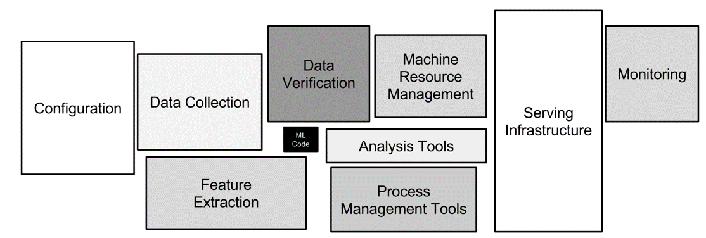
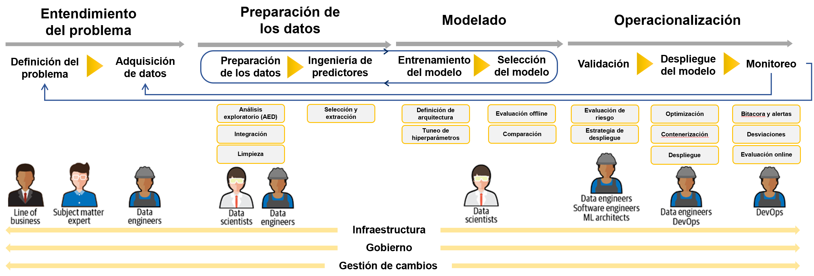

========================================================
Ciclo de desarrollo de modelos de aprendizaje automático
========================================================

Introducción
------------

Cuando pensamos en toda las piezas que son necesarias para llevar adelante un proyecto que está basado en aprendizaje automático en el contexto de una organización, el modelo propiamente dicho, ocupa sólo una pequeña parte de todo el andamiaje que la organización debe de disponibilizar para que el mismo pueda ejecutarse de forma segura y confiable. Si incluso mantuvieramos los componentes a lo mínimo e indispensable, encontraríamos que necesitamos al menos datos sobre los cuales entrenar nuestro modelo, infraestructura donde ejecutarlo y alguna forma de consumirlo.

  *Componentes dentro de una solución de aprendizaje automático* [1]_

Esta complejidad está basada en que, a diferencia del software tradicional, nuestras soluciones son una combinación de datos y código.

.. math::

   Sistemas\; de\; AI = código + datos

Esto nos da la pauta de que al momento de llevar adelante nuestro proyecto basado en datos, debemos de asegurarnos de que todas estas piezas se mueven al unísono y de una forma consistente con la expectativa que tiene nuestro proyecto. Esto lo haremos definiendo un proceso de desarrollo que nos dé la flexibilidad necesaria para adaptarnos a las necesidades de cada organización pero al mismo tiempo nos asegure el éxito al final del camino. 

En la industria, no existe un proceso de desarrollo único que funcione para todas las organizaciones. Existen multiples corrientes que sostiene procesos más extrictos, con más o menos pasos. En general, cada organización deberá adaptar el proceso en mayor o menor médida a sus necesidades. Aquí, presentaremos un marco de trabajo o framework general que puede ser utilizado como base en cualquier organización.

Proceso
-------
El proceso de desarrollo de un modelo de aprendizaje automático es un proceso iterativo, y es importante entender que en general entraremos en este proceso no solo *una vez*, sino que lo haremos **multiples veces**. El concepto de proceso iterativo no es nuevo en la industría de software donde se opera con metodologías ágiles, sin embargo la necesidad dentro de este concepto rádica en otro lugar. La tarea de desarrollar un modelo basado en datos es un proceso de descubrimiento y experimentación. Es un proceso por el cual la organización quiere adquirir conocimiento a partir de datos y por lo tanto es difícil pensar que podremos obtener lo que buscamos en nuestro primer acercamiento al problema.

Es más, desarrollar y desplegar nuevas versiones de los modelos de aprendizaje automático es central para implementar `mejora continua <https://es.wikipedia.org/wiki/Proceso_de_mejora_continua>`_. Existen varias razones para iterar y desplegar nuevas versiones de los modelos incluyendo su degradación de performance en el tiempo, cambios en los esquemas de los datos, detección de nuevos patrones en los datos, etc. En algunos casos puede ser que las consideraciones de negocio hayan cambiado, que el proceso de recolección de datos haya mejorado o que simplemente nuestros científicos/analístas de datos encontraron una mejor forma de resolver el problema.

Presentaremos un proceso de desarrollo que luce a alto nivel de la siguiente manera:

   *Proceso de desarrollo de modelos de aprendizaje automático*

Es fácil identificar varios desafíos a la hora de llevar adelante este proceso:

- Los modelos de aprendizaje automático son una combinación de codigo y datos y por lo tanto, es necesario disponer de un control de versiones que nos permita controlar el cambio y la evolución en cada iteración en ambos elementos.
- El desarrollo de estos modelos requiere involucrar multiples roles y personas dentro de la organización.
- Se deben integrar una gran cantidad de piezas para poder cubrir el ciclo de desarrollo de un modelo de aprendizaje automático.

Iteraciones
-----------
Mencionamos que uno de los conceptos fundamentales dentro del desarrollo de modelos de aprendizaje automático es la capacidad de iterar en el proceso de desarrollo múltiples veces. En algunas organizaciones, estas iteraciones pueden darse bastante rápido. Por ejemplo, es posible que nuevas muestras de datos estén disponibles todos los días y que existen requerimientos de negocio para reentrenar el modelo considerando estas nuevas observaciones. Si bien reentrenar no implica volver a realizar ingeniería de predictores o selección de modelos, si requerirá verificar que el conjunto de datos luce como se espera, por ejemplo. Lo que no debemos perder de vista es que **el qué tan lejos llegaremos con nuestro modelo no está controlado por el tiempo invertimos en cada iteración, sino por cuantas veces iteramos sobre el proceso**. Esto es un cambio importante en la filosofía de desarrollo.

Velocidad
^^^^^^^^^

La velocidad en la que iteramos en el proyecto también pondrá presión, como podrá esperar, en las personas y recursos que soportan el proceso. En aquellas organizaciones que desean iterar rápidamente (por ejemplo, requieren de reentrenar el modelo de aprendizaje todos los días para capturar nuevos patrones en los datos), la presión podría ser tal que no es fáctible de alcanzar la velocidad necesaria. En este caso, disponer de procesos automáticos para implementar todo el ciclo que describiremos a continuación es fundamental. Vea :ref:`rst_mlops` para una visión mas ámplia sobre este último concepto.

.. [1] Google (2015), Hidden Technical Debt in Machine Learning Systems
