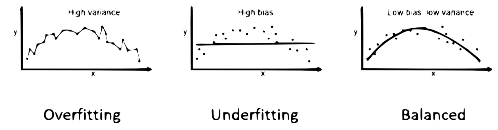

==============
Sesgo-varianza
==============

El dilema o problema sesgo-varianza es el conflicto al tratar de minimizar simultáneamente dos fuentes de error:

:El sesgo (bias): Es el error que se genera por suposiciones erróneas o inexactas en el algoritmo de aprendizaje. Un sesgo alto puede hacer que el modelo pierda detalles relevantes entre los predictores y la variable que queremos predecir (underfitting)
:La varianza (variance): Es el error asociado a la sensibilidad del modelo a pequeñas fluctuaciones en el set de entrenamiento. Una varianza alta puede hacer que un algoritmo modele el ruido en los datos de entrenamiento, en lugar de la información subyacente (overfitting).

   *Sesgo-varianza*

Utilizando un enfoque más moderno o inspirado en las técnicas de aprendizaje profundo, dejamos de hablar de la tensión entre el sesgo y la varianza para hablar en su lugar de la relación entre la complejidad del modelo y el error, detectando las situaciones:

:Underfitting: Cuando el modelo no puede reducir el error tanto en el set de entrenamiento como en el de evaluación. La causa es una capacidad insuficiente del modelo; es decir, no es lo suficientemente potente como para adaptarse a las complejidades subyacentes de las distribuciones de datos.
:Overfitting: Cuando el modelo es tan poderoso que se ajusta demasiado bien al set de entrenamiento, mientras luego no puede generalizarlo al set de evaluación.

.. figure:: ../../_images/train_fitting_modern.png
   :alt: Complejidad del modelo vs error
   :align: center
   :width: 500

   *Sesgo-varianzaComplejidad del modelo vs error*