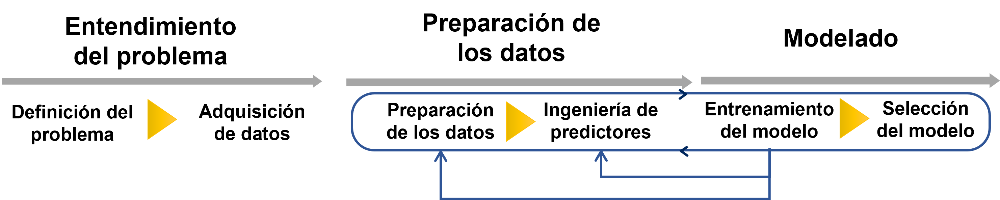
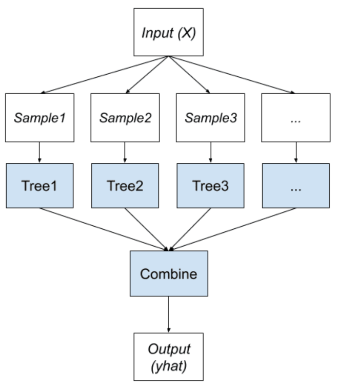
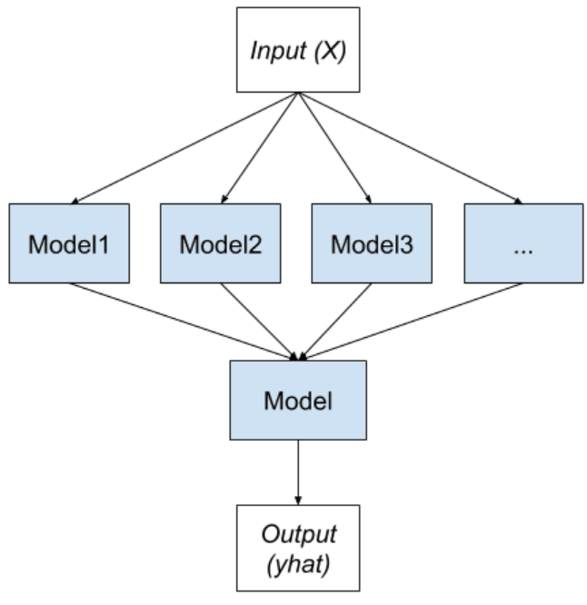
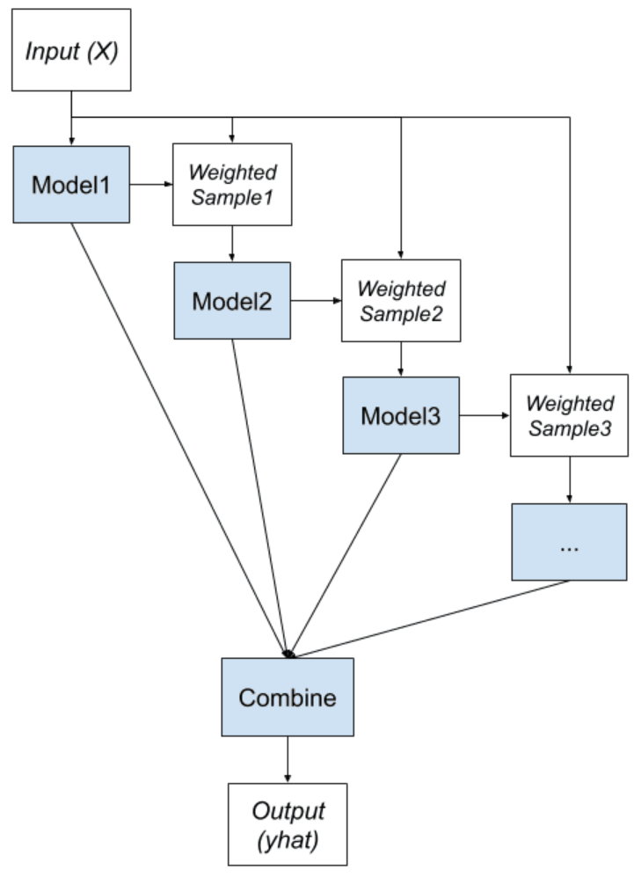

========================
Entrenamiento del modelo
========================

Durante el proceso de experimentación o entrenamiento del modelo, nuestro objetivo definir una arquitectura para el modelo de aprendizaje automático y estimar los parámetros que obtienen la mejor performance.

Definición de una linea base
----------------------------

Establecer una línea base para nuestro modelo es una tarea que muchas veces se pasa por alto, pero es increíblemente útil a la hora de experimentar e iterar sobre diferentes propuestas de modelos. Básicamente esta tarea consiste en identificar cual es la performance base a la que podríamos aspirar de mínima. Esto en general puede realizarse investigando problemas similares o cómo la competencia resuelve el problema. Para muchas tareas, podemos utilizar como línea base la performance a la que alcanza una persona resolviendo el problema. En cualquiera de los casos es importante tener este concepto en mente y cuantificarlo para luego poder determinar si, por ejemplo, un accuracy de 0.78 es bueno o malo.

Definición de la arquitectura
-----------------------------

El concepto de arquitectura hace referencia a los componentes que conforman nuestro modelo de aprendizaje automático. Esta arquitectura define como nuestro modelo utilizará los datos para extraer el conocimiento que se necesita y luego entregar los resultados. En general las arquitecturas de aprendizaje automático están divididas según los diferentes algorimtos que utilizan siendo estos *Supervisados*, *No supervisados* y *Aprendizaje reforzado*.

   La elección de una arquitectura para el modelo como un proceso iterativo

La elección de una arquitectura para el modelo es un proceso iterativo, donde el desarrollador propone diversas arquitecturas basado en la naturaleza del problema, su intuación y su experiencia. En general sabemos que determinadas arquitecturas tienden a funcionar bien en determinadas configuraciones. Por ejemplo, sabemos que redes neuronales del tipo CNN son útiles en problemas relacionados con clasificación de imágenes. Adicionalmente, la calidad de los datos disponibles también directará el tipo de arquitectura que podemos considerar.

Ajuste en la preparación/adquisición de datos
^^^^^^^^^^^^^^^^^^^^^^^^^^^^^^^^^^^^^^^^^^^^^

Es posible que durante la fase de experimentación encontremos signos de que nuestro modelo no está generalizando correctamente. Estos signos podrías indicar que nuestor conjunto de datos tiene problemas de calidad o que quizás es insuficiente. Es importante tener en mente este concepto y permitirse revisar la calidad, cantidad y diversidad de los datos. Las técnicas de :ref:`rst_error_analysis` son una herramienta útil para identificar sobre que porciones de los datos el modelo está teniendo dificultades y revisar las estrategias de :ref:`rst_data_adquire_ingest_generate` datos.

Ajuste en la ingeniería de predictores
^^^^^^^^^^^^^^^^^^^^^^^^^^^^^^^^^^^^^^

Determinadas arquitecturas realizan suposiciones sobre los datos que deben de complirse. Por ejemplo, es posible que el modelo requiera que los datos estén normalizados de determinada manera o que las variables categóricas estén codificadas utilizando alguna metodología en particular. Es probable que deba revisar la ingeniería de predictores durante la fase de experimentación.

.. note:: Esta dependencia es importante de mantenerla ya que cuando implemente procesos de :ref:`rst_mlops` donde hay procesos de integración de datos automáticos, esta reingeniería debe ser aplicada.

Estrategias de entrenamiento
----------------------------

Si bien está fuera del alcance de este documento, existen una serie de consideraciones que se pueden tener a la hora de implementar un procedimiento de entrenamiento. Estos detalles de implementación pueden alterar la forma en que los datos son recolectados y procesados.

Entrenamiento estratificado de modelos
^^^^^^^^^^^^^^^^^^^^^^^^^^^^^^^^^^^^^^

Supongamos que una organización quiere predecir la demanda de productos de los clientes para optimizar la cantidad su cadena de suministro. Sin embargo, el comportamiento varía mucho de una ciudad a la otra, o de un estado al otro. Incluso podría ser que varia de cada una de las locaciones. El modelado estratificado consiste en entrenar un modelo por cada ubicación que la organización dispone en lugar de buscar entrenar un modelo que pueda resolver todas las ubicaciones correctamente.

Centralizado vs federado
^^^^^^^^^^^^^^^^^^^^^^^^

Cuando los modelos de aprendizaje automático serán desplegados en millones de dispositivos, como ser teléfonos celulares, sensores o incluso autos hoy en día, el entrenamiento de estos modelos puede ser desafiante. Quizás la opción mas sencilla de visualizar es recolectar toda la información de estos dispositivos en una ubicación centralizada para confirmar el conjunto de datos sobre el que se va a trabajar. Luego, un modelo se entrena de forma centralizado y se despliega en cada uno de los dispositivos en cuestión. Por ejemlo, el sistema de autompiloto de Tesla (Tesla Autopilot System), que se ejecuta en mas de 500.000 autos hoy en día funciona de esta forma.

Otra alternativa a esta es, en lugar de utilizar un proceso centralizado de entrenamiento, realizar "pequeños entrenamientos de ajuste" (técnica conocida como fine tunning) en cada uno de los dispositivos en cuestión. Estos ajustes o mejoras que cada uno de los dispositivos encuentra, son luego reportadas a un servidor centralizado que recolecta el feedback de cada uno de los dispositivos y los condenza. Estas actualizaciones pueden luego ser "empujadas" a cada uno de los modelos nuevamente para que todos se beneficien. Esta técnica de entrenamiento se conoce como **Federated Learning** y tiene ademas la ventaja de que los datos de cada uno de los dispositivos no viaja a una ubicación centralizada, lo cual puede tener implicancias desde el punto de vista regulatorio.

Ensembles
^^^^^^^^^

El enfoque de entranamiento utilizando *ensembles* busca moverse en la dirección opuesta del concepto de `Entrenamiento estratificado de modelos`_ ya que busca un mejor rendimiento predictivo al combinar las predicciones de varios modelos, a diferencia del método anterior donde buscamos utilizar un modelo especifico para cada partición de los datos.

Aunque hay númerosas formas de implementar está idea, hay tres métodos que dominan el campo. Las tres clases principales de métodos de aprendizaje por Ensembles son **bagging**, **stacking**, y **boosting**, y es importante tener una idea detallada de cada método y considerarlos.

Bagging
~~~~~~~
El nombre *Bagging* proviene de la abreviatura de Bootstrap AGGregatING. Como su nombre lo indica, los dos ingredientes clave de Bagging son *bootstrap* y *combinación*. Por lo general, esto implica el uso de un solo algoritmo de aprendizaje automático, casi siempre un árbol de decisiones, el cual es entrenado utilizando diferentes conjuntos de datosde entrenamiento. Asi se generan N arboles completamente expandidos y las predicciones que realizan cada uno de los miembros del conjunto se combinan usando alguna estadística simple: votaciones, promedios, promedios ponderados, etc.

La clave del método es la forma en que se genera cada conjunto de datos para entrenar cada modelo. Aquí, cada modelo obtiene su propio conjunto de datos utilizando el método de *boostrap*. Esto quiere decir que una fila dada puede estar presente en un conjunto de datos cero, una o multiples veces.

   Bagging

Stacking
~~~~~~~~
*Stacking* es un método que busca generar un grupo diverso de modelos (llamados modelos de primer nivel) variando el tipo de modelos/algoritmo propiamente dicho para luego, usando otro modelo (llamado de segundo nivel), combine todas las predicciones de los otros modelos. Se puede usar cualquier modelo de aprendizaje automático para combinar las predicciones, aunque es común usar un modelo lineal, como la regresión lineal para la regresión y la regresión logística para la clasificación binaria. Esto fomenta que la complejidad resida en los modelos de primer nivel mientras que los modelos de segundo nivel permanecen simples, aprovechando la variedad de predicciones realizadas.

   Stacking

Boosting
~~~~~~~~
*Boosting* es un método que busca cambiar los datos de entrenamiento para centrar la atención de futuros modelos en ejemplos en los que modelos anteriores se han equivocado. Es decir, entrena una secuencia de modelos donde cada modelo subsiguiente presta más atención a los errores que el modelo anterior cometió. La elemento clave es la idea de corregir errores de predicción. Los modelos se entrenan y se agregan al conjunto de modelos secuencialmente de modo que el segundo modelo intenta corregir las predicciones del primer modelo, el tercero corrige el segundo modelo, y así sucesivamente.

Por lo general, esto implica el uso de árboles de decisiones muy simples que solo toman una o pocas decisiones (weak-learners). Las predicciones de los modelos se combinan mediante votaciones o promedios, aunque las contribuciones se pesan de manera proporcional a performance.

   Boosting

.. note:: Lectura recomendada: `https://machinelearningmastery.com/tour-of-ensemble-learning-algorithms/ <https://machinelearningmastery.com/tour-of-ensemble-learning-algorithms/>`_.

.. toctree::
   :maxdepth: 2
   :caption: En esta sección
   :hidden:

   Sesgo-varianza <bias-and-variance>
   Tuneo de hiperparámetros <tuning>
   Experimentos y ejecuciones <code/tuning_bayesian.ipynb>
