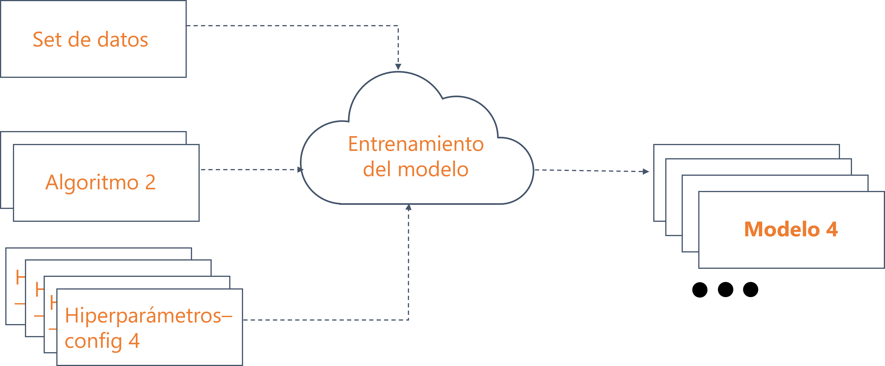

=========================
Ajuste de hiperparámetros
=========================

Según el teorema de **no free lunch (NFL)**, no existe un algoritmo universal que funcione bien para cualquier conjunto de datos y para cualquier problema. Esto indica que es necesario adaptar el algoritmo elegido al problema en cuestión para mejorar el rendimiento del mismo y asi obtener un buen modelo.

El ajuste de hiperparámetros, es decir el proceso que busca optimizar los valores de los parámetros para obtener una buena solución, generalmente requiere una gran cantidad de ejecuciones del algoritmo para analizar su rendimiento en una instancia con diferentes configuraciones de parámetros. Esto hace que el proceso de ajuste requiera mucho tiempo y computo.

   *Proceso de tuneo de hiperparámetros*

Estrategias
-----------
Típicamente existen 3 formas de elegir los hiperparámetros de nuestro modelo:

:Utilizar nuestra experiencia: Utilizar la experiencia propia para determinar que valores de hiperparámetros utilizar. Esta estrategia claramente requiere de experiencia por parte del científico o analísta de datos.
:Explorar el espacio aleatoriamente: Probar cada una de las combinaciones o un subset de las combinaciones de hiperparámetros posibles. Esto se puede realizar de forma exahustiva o probando solo k combinaciones. Probar todas las combinaciones puede resultar prohivitivo en terminos de costos e incluso en terminos de tiempos si el espacio a explorar es demasiado grande. En este punto, probar solo k combinaciones de forma aleatoria parece ser una mejor elección. Sin embargo, no tenemos ninguna garantía de obtener algun resultado bueno.
:Utilizar una búsqueda guiada: Consiste en probar diferentes combinaciones de parámetros, pero en lugar de elegir la próxima combinación de forma aleatoria la (próxima) combinación explora el espacio de parámetros moviendose en la dirección que maximiza la probabilidad de obtener un mejor resultado. Ejemplos de esto por ejemplo es la `Optimización Bayesiana <https://en.wikipedia.org/wiki/Bayesian_optimization>`_.

Ejemplos
--------

.. toctree::
  :glob:
  :maxdepth: 1
  :titlesonly:

  code/*.ipynb
