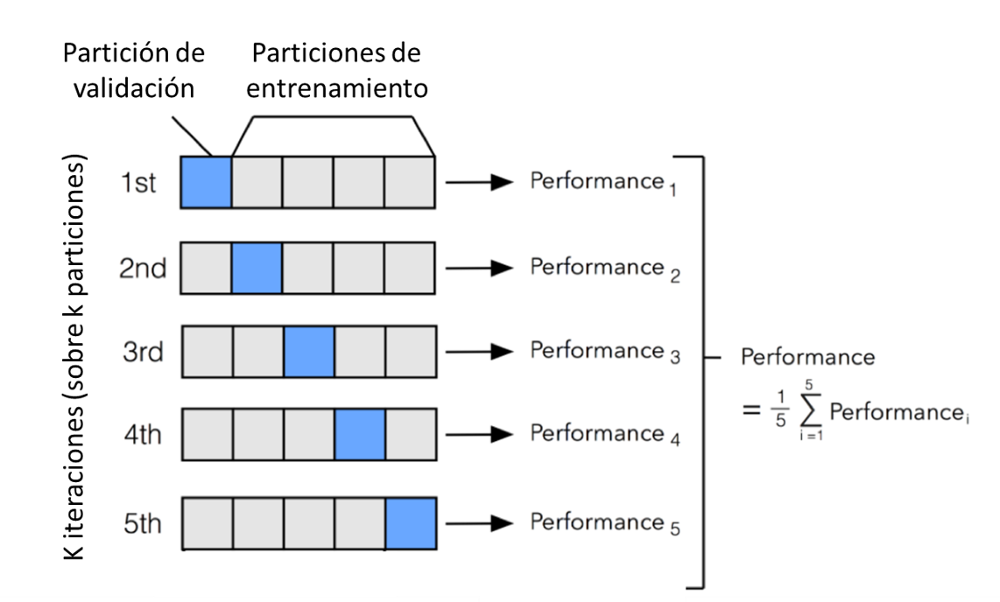
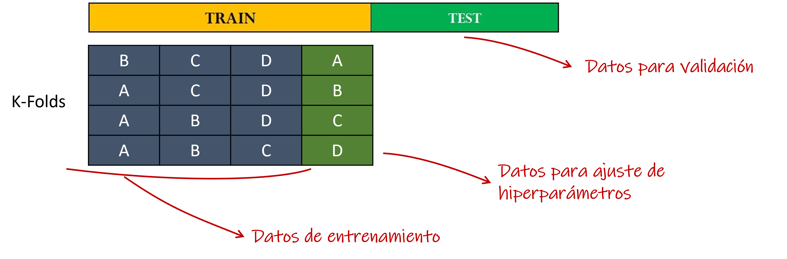

========
Modelado
========

   "We now build machines that learn from their experience electronically, automatically... *software-aclly*"
   
   -- Bill Nye, American Engineer, The Planetary Society's CEO.

Experimentación y selección
---------------------------

La fase de modelado tiene como objetivo obtener un modelo de aprendizaje entrenado junto con una estimación de una métrica de performance que estime que tan bien o mal funcionará el modelo cuando se encuentre con el mundo real. La fase quizás intensiva en cantidad de tiempo sea el entrenamiento del modelo o `experimentación`.

Durante el :doc:`experimentation/intro` buscamos generar una arquitectura de un modelo de aprendizaje automático y estimar sus parámetros. Esta estimación de la mejor combinación de hiper-parámetros se lo conoce como :doc:`experimentation/tunning`

Una vez que disponemos de un modelo o un conjunto de modelos candidatos, debemos de poder seleccionar si el modelo que obtuvimos es (1) mejor que el que teníamos anteriormente y/o (2) ofrece una mejora para la organización en el proceso de negocio que intenta atacar. Esto último requiere poder estimar la performance que el modelo tendrá en el mundo real. Esta métrica se la conoce como métrica de :doc:`selection/offlineEval`. Adicionalmente, esperaremos que nuestros modelos cometan errores, sin embargo, podemos estar interesado en detectar que tipo de errores comenten y así poder seleccionar el modelo que comente los errores menos dañinos para nuestro negocio. Todo este proceso lo revisaremos en la sección :doc:`selection/intro`

Conjuntos de datos
------------------

Para poder (1) entrenar un modelo de aprendizaje automático basado en datos y (2) seleccionar que modelo ofrece el mayor valor para el negocio en el problema indicado deberemos disponer de diferentes conjuntos de datos. Esto se debe a que para poder comparar correctamente los diferentes modelos, la métrica elegida debe ser estimada utilizando un conjunto de datos que el modelo nunca ha visto durante su entrenamiento ni tampoco durante la fase de :doc:`experimentation/tunning`. En general tenemos 2 técnicas para realizar esto:

Hold-out
^^^^^^^^

El método de hold-out validation básicamente separa el set de datos en 2 partes. Dado un data set de `m` registros, entonces el mismo se divide en `t` registros para entrenamiento y `v` registros para validación.

   Método hold-out

.. note:: Note que si utilizamos un método de estimación de hiperparámetros que requiere datos, estos datos deben ser obtenidos del conjunto de entrenamiento. El conjunto de validación no puede ser utilizado para ninguna tarea de estimación de parámetros.

Validación cruzada
^^^^^^^^^^^^^^^^^^

En algunos casos, no tenemos suficientes datos para garantizar buenas estimaciones de las métricas sin dañanr la performance del modelo. Una forma de resolver este problema es utilizando validación cruzada. La validación cruzada consiste en realizar múltiples particiones de los datos para luego estimar la métrica en cada partición y finalmente promediar los resultados. Existen múltiples formas de realizar estas particiones pero la más utilizada es k-fold cross validation.

   Validación cruzada con 5 particiones

.. warning:: Validación cruzada es un método para estimar la performance de generalización de un modelo entrenado sobre todo el conjunto de datos. Es decir que la métrica que estima es la que el modelo obtendría si se entrenara sobre todo el conjunto de datos. Sin embargo, ¡al final genera K diferentes modelos!

Finalmente, el modelo resultante debe ser construido usando alguna de las siguientes alternativas:

- Entrenar un nuevo modelo con todo el conjunto de datos.
- Generar un voting ensamble con los K diferentes modelos.

A pesar de que estas estrategias son válidas, requieren el entrenamiento de un nuevo modelo como resultado. Generalmente, la validación cruzada se utiliza durante la fase de entrenamiento, mientras que la evaluación y selección utiliza el método de hold-out.

   Cross-validation y hold-out combinados

.. toctree::
   :maxdepth: 2
   :caption: En esta sección
   :hidden:

   Entrenamiento del modelo <experimentation/intro>
   Selección del modelo <selection/intro>