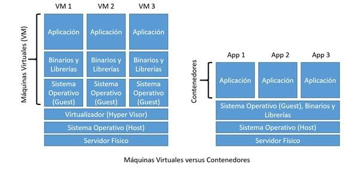

Contenerización
===============
En la sección :doc:`../validation/intro` revisamos la importancia de poder versionar y documentar en detalle todos los requerimientos que nuestros modelos tienen para poder ejecutarse correctamente. En :doc:`../validation/auditing` revisamos los requerimientos para, a partir de este detalle, poder llegar a disponer de modelos que son **reproducibles** y **auditables**. Sin embargo, no hemos revisado aún alguna metodología para facilitar poder reconstruir estos ambientes donde nuestros modelos fueron entrenados.

Poder desplegar nuestos modelos en ambientes que dispongan de todos los requerimientos de nuestros modelos es imperativo. Sin embargo, es posible que no dispongamos de una infraestructura dedicada para nuestro modelo, es decir, que estemos compartiendo la infraestructura con otros sistemas de software. Incluso podría ser el caso donde si bien disponemos de una infraestructura dedicada para nuestro modelo, tengamos sobre la misma infraestructura varias versiones del mismo modelo en ejecución tal como se revisará en la sección :doc:`deployment`. En estos casos necesitaremos una manera de mantener estas instancias de forma aislada la una de la otra. Una forma de alcanzar este requerimiento (y quizás la forma más ampliamente utilizada) es utilizando `contenedores`.

Contenedores
------------
Los contenedores son ambientes de ejecución livianos que proveen a las aplicaciones con los archivos, variables y librerías que necesitan para operar. Se utilizan para garantizar que una aplicación se ejecute correctamente cuando se mueve de un lugar a otro, con una reducción al mínimo de las fallas posibles y una maximización de su portabilidad. Los contenedores se asemejan a la virtualización clásica (donde el concepto más conocido es el de máquina virtual) aunque funcionan en un plano más bajo: mientras que las máquinas virtuales habilitan la virtualización de la infraestructura (servidores), los contenedores permiten la virtualización de las aplicaciones. A diferencia de las máquinas virtuales, los contenedores utilizan el sistema operativo (SO) de su host, en lugar de integrar uno propio.

   Esquema que ejemplifica la diferencia entre virtualización tradicional y contenedores de software. Fuente: `Fayerwayer <https://www.fayerwayer.com/2016/06/maquinas-virtuales-vs-contenedores-que-son-y-como-elegir-entre-estas-tecnologias/>`_

Ventajas y desafios
-------------------
TODO

Contenerización de modelos de aprendizaje
-----------------------------------------
Podriamos tener:
 - Un modelo en un servidor.
 - Un modelo en multiples servidores.
 - Varios modelos en un servidor.
 - Varios modelos en multiples servidores.
 - Multiples versiones de un modelo en un servidor.
 - Multiples versiones de un modelo en multiples servidores.
 - Multiples versiones de multiples modelos en multiples servidores (miedo).

