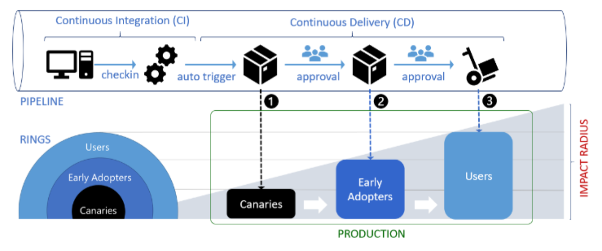

=========================
Estratégias de despliegue
=========================

Hay dos conceptos importantes a tener en cuenta a la hora de poner un modelo de aprendizaje automático a disposición de nuestros usuarios, y son: los **despliegues** (*o deployment*) y los **lanzamientos** (aunque más conocidos como *releases*). Un despliegue es el proceso por el cual el código/modelo se ubicado o se instala en su ubicación final. Esta ubicación podría ser un servidor web, un dispositivo movil de un usuario, etc. Un release, por el contrario, es el proceso por el cúal el o los usuarios obtienen acceso al nuevo código/modelo/funcionalidad como parte de un objetivo de negocio. 

La diferencia más importante entre un despliege y un lanzamiento tiene que ver con el **nivel de riesgo**. Mientras un despliegue es una operación de bajo riesgo, la liberación es una operación de alto riesgo. Vea :doc:`../validation/riskmodel` para más detalles sobre el concepto de *riesgo*.

En algunos casos estos dos procesos se dan al unísono, pero no necesariamente. Un release, por ejemplo, puede involucrar varias instancias de despliegue y, también, un despliegue puede tener multiples releases o releases progresivos. En general, el proceso de despliegue es controlado por un área técnica de operaciones o incluso un proceso automático. El proceso de release, en general es controlado por el equipo responsable del producto.

A contuación veremos varias técnicas para controlar tanto el proceso de despliegue y el proceso de versiones o lanzamientos.

Blue/Green
----------
Uno de los desafios más grandes a la hora de realizar un despliegue es el "corte" entre la versión antigua y la nueva versión del modelo. En general, uno necesita que este pasaje se realice rápido para evitar tener interrupciones en los servicios que el modelo provee. Sin embargo, no queremos cambiar de modelo hasta estar seguros de que funciona correctamente en el ambiente productivo. El despliegue de tipo Blue/Green (o a veces conocido como black/red) trata de atacar esta problemática al proveer 2 ambientes productivos identicos (o tan identicos como sea posible). El nuevo modelo entonces es desplegado en un ambiente identico a producción al que llamamos **green**, mientras que el modelo original continua funcionando en el ambiente **blue**. Las fases finales de validación y control se realizan en este ambiente *green*. Una vez que nos aseguramos que el modelo funciona como esperamos, se realiza un intercambio de ambientes, es decir **green** toma el lugar de **blue** y viceversa. Esto se realiza con una simple configuración de ruteo de red para que todas las solicitudes ahora sean contestadas por el otro ambiente.

Este tipo de despliegue también tiene la ventaja de que permite una rápida *vuelta atrás* o **roll-back** ya que si algo no funciona como esperamos, podemos a volver a hacer el cambio. Por supuerto que, de ser este el caso y necesitar deshacer la operación, se habrán perdido todas las solicitudes que llegaron durante el periodo en donde el ambiente *green* estuvo respondiendo solicitudes. Estos casos pueden ser resueltos implementando algo similar a :ref:`rst_shadow_testing` que veremos más adelante.

Una vez que el despliegue finaliza y es aceptado, el ambiente *green* pasa a llamarse *blue*, y el antiguo ambiente *green* queda disponible para desplegar las proximas versiones del modelo en cuestión.

.. _rst_progressive_rollouts:

Progressive Rollouts
--------------------

   *Despliegues progresivos utilizando rings o anillos*

.. _rst_canary_releases:

Canary releases
---------------
Versiones canarias, o *canary releases*, es una técnica para reducir el riesgo asociado al introducir una nueva versión del modelo en producción. Se basa en la idea de introducir los cambios a un pequeño subset de usuarios antes de desplegar la nueva versión por completo y habilitarla para todos los usuarios. Su nombre está relacionado con los canarios que se utilizaban en las minas en donde, si el canario *dejaba de cantar* significaba que había problemas.

Similar a `Blue/Green`_ , la nueva versión del modelo se despliega en un ambiente lo más similar al productivo posible y las pruebas de validación se realizan sobre el mismo. Una vez que estás pruebas se completaron, un pequeño grupo de usuarios es redireccionado para que utilice el nuevo ambientes - *green*. Esta selección puede realizar de forma simple elijiendolos al azar, o de forma más compleja, basada en propiedades del perfil del usuario, usuarios externos vs interos, etc. A medida que se gana más confianza con el nuevo despliegue, más usuarios son dirijidos a la nueva versión del modelo hasta que finalmente el 100% de los usuarios es direccionado al nuevo modelo y su versión anterior permanece inactiva. En este punto, podemos decomisar la infraestructura asociado con el modelo anterior.

La elección de qué usuarios asignar a nuestro `canary release` podría no ser trivial. Probablemente quisieramos asignar grupos de usuarios basandose en alguna propiedad demográfica. Pero podría ser el caso que nuestro modelo opere correctamente para esta porción de la población, mientras que para el resto de la población resulte errático. Por el contrario, una estratégia más robusta sería elegir a los usuarios de forma aleatoria y, de ese modo, obtener una muestra más representativa. Sin embargo, probablmente querrámos que nuestros usuarios tengan una experiencia consistente cuando utilizan nuestros servicios, por lo que deberemos aplicar algún tipo de afinidad: una vez que un usuarios es asignado a una versión canaria, entonces permanecerá en esa versión canaria hasta que el despliegue se haya completado.

Una de las ventajas más visibles de esta técnica es que podemos ir realizando pruebas de estrés y capacidad a medida que nuevos usuarios ingresan a la nueva versión del modelo. Esto lo logramos monitoreando las métricas de utilización de recursos. Adicionalmente, si encontramos un problema, siempre podemos volver hacia atrás con el despliegue. Este proceso de análisis puede ser incluso automátizado a traves de :doc:`automate_canary`.

Despliegue y verificación
-------------------------
En muchas ocaciones, nuestros modelos interactuan con nuestros usuarios o procesos de negocio y por lo tanto es complejo verificar que el comportamiento que finalmente tenga el modelo en la organización es que deseamos. *¿Cómo podríamos saber si la utilización de un modelo de aprendizaje automático es efectivamente mejor que la forma actual que tenemos de realizar las cosas en la organización?*. Este tipo de preguntas y experimentos podemos conducirlos a traves de metodos como los siguientes donde no solamente desplegamos el modelo de forma controlada sino que lo hacemos de tal forma que podamos extraer conclusiones:

.. _rst_shadow_testing:

Shadow testing
^^^^^^^^^^^^^^
Una técnica para mitigar el riesgo de introducir un modelo de aprendizaje automático en un proceos de negocio consiste en desplegar el nuevo modelo, `modelo B`, junto con el modelo actual `modelo A`. En esta configuración, cada vez que ingresa una nueva solicitud para ejecutar el modelo, tanto el `modelo A` como el `modelo B` se ejecutan, aunque solo las predicciones de `modelo A` son retornadas a quien lo solicitó. Las prediciones de `modelo B` son registradas vía logging. 

Este tipo de despliegue permite comparar estadísticamente los resultados de los modelos `modelo A` y `modelo B` sin comprometer el proceso de negocio actual. Si el resultado de esta prueba es satisfactoria, entonces, el `modelo B` toma el lugar del `modelo A`. Esta técnica se conoce como *shadow scoring* y permite implementar transiciones controladas entre diferentes versiones del modelo.

.. note:: Shadow scoring supone que el valor verdadero de la predicción no depende de una acción que es consecuencia de la predicción. Por ejemplo, en el caso de un modelo que recomienda un elemento para comprar en un sitio de compras por internet, solo las predicciones de un modelo podrán ser evaluadas ya que es imposible determinar la performance del `modelo B` sin mostrar la recomendación propiamente dicha para que el usuario haga clic. En estos casos, está técnica es de poca utilidad y debe evaluarse alguna de las siguientes.

.. _rst_ab_testing:

A/B testing
^^^^^^^^^^^
Similar a `Blue/Green`_ , la nueva versión del modelo se despliega en un ambiente lo más similar al productivo posible y las pruebas de validación se realizan sobre el mismo. Sin embargo, en A/B testing, las solicitudes de ejecución del modelo se distribuyen entre los dos ambientes y modelos. Es decir, algunas solicitudes son enviadas al `modelo A` y otras solicitudes al `modelo B`. Cada solicitud es procesada o por uno o por el otro, pero nunca por ambos. Los resultados de ambos modelos son registrados via logging para el análisis.

.. warning:: A primera vista, esta técnica puede parecer similar a `Canary releases`_ debido a similaridades técnicas de implementación. Sin embargo, no deben confundirse. Mientras que *Canary releases* es una técnica para detectar problemas al implementar modelos de forma gradual utilizando un *canario*, A/B testing es una técnica para probar una hipótesis utilizando variaciones de un modelo (o multiples modelos). Incluso, dependiendo del tráfico, esperariamos poder concluir con un despluegue de tipo canario en horas, mientras que para una prueba A/B deberiamos de esperar hasta que nuestra prueba alcance significancia estadística.

.. _rst_champion_challenger:

Champion/Challenger
^^^^^^^^^^^^^^^^^^^
Se trata de una técnica similar a :ref:`rst_ab_testing` y que suele implementarse mediate `Blue/Green`_, con la diferencia de que al finalizar el experimento no habrá un método ganador. En Champion/Challenger tenemos una forma actual de realizar las cosas, gobernada por el **Champion**, y una forma alternativa - que se supone superior - gobernada por el **Challenger**. 

En esta configuración, es común que la mayoría del tráfico que utiliza la aplicación o servicio que consume nuestro modelo de aprendizaje automático esté asociado con el **Champion**, y una porción más pequeña con el **Challenger**. Una vez finalizado el experimento, no se disponé de un método ganador sino que se dispone de una estimación de que tan bueno o malo es nuestro modelo de aprendizaje automático.

.. _rst_testing_interleaving:

Interleaving
^^^^^^^^^^^^
Interleaving es una técnica que puede aplicarse tanto para despliegues de tipo `Blue/Green`_ o `Canary releases`_ y muy similar a `A/B testing`_ salvo que aplica en aquellos casos donde los modelos no predicen un único valor sino que una secuencia de valores con un `rank` asociado. Por ejemplo, en sistemas de recomendación. Interleaving es una técnica que mezcla las recomendaciones de varios sistemas de recomendación (modelos) con el objetivo de limitar el risgo de obtener recomendaciones irrelevantes. Basicamente, consiste de 2 pasos:

#. Combinar las recomendaciones de 2 o más sistemas de recomendación.
#. Interpretar las interacciones de las recomendaciones propuestas.

.. note:: Para mayor información sobre esta técnica puede revisar: K. Hofmann, L. Li, and F. Radlinski. Online Evaluation for Information Retrieval. Foundations and Trends® in Information Retrieval, 10(1):1–117, 2016

.. toctree::
    :maxdepth: 2
    :caption: Ejemplos
    :hidden:
    
    Análisis automático de Canary Releases <automate_canary>