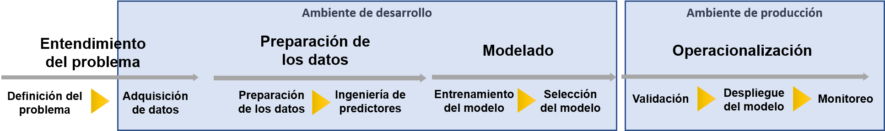

.. index:: Operacionalización

==================
Operacionalización
==================

Las organizaciones ven el poder desplegar soluciones de software rapidamente en producción como un factor clave para alcanzar sus objetivos de negocio, pero al mismo tiempo, esto es solo cierto si tal despliegue asegura mínimos riesgos. Obtener un modelo funcionando en un ambiente de desarrollo no es garantia alguna de que nuestro modelo funcionará en cuando se encuentre con el mundo real: ya sea con usuarios reales, con procesos de negocio reales, o con consecuencias reales. *Operacionalización* es el proceso por el cual un modelos de aprendizaje automático es empaquetado y disponibilizado para ser consumido. Cuando este modelo es consumido por los procesos de negocio reales de la organización, dirémos que el modelo está **productivo** o en un **ambiente de producción**. 

Los ambientes productivos dentro de una organización pueden tomar diferentes formas: desde servidores en centro de cómputos, plataformas de ciencias de datos específicas, como parte de un software que se distribuye a los clientes de la organización, como parte de una aplicación o incluso como parte de un dispositivo que vendemos (por ejemplo, el caso de los automobiles Tesla).

   *Separación de ambientes dentro del proceso de desarrollo de modelos de aprendizaje automático.*

Idealmente, esperariamos poder empaquetar nuetro modelo desarrollado con minimos cambios a un ambiente productivo ya que, de esa forma, minimizariamos el riesgo de que nuestro modelo se comporte distinto que como lo hacia en desarrollo. Sin embargo, en la práctica, es mucho mas común de lo que uno espera de que este no sea el caso. Adaptaciones deben de realizarse al modelo para que pueda ser puesto en producción de forma correcta.

.. toctree::
   :maxdepth: 2
   :caption: En esta sección
   :hidden:

   Adaptación del modelo <adaptation/intro>
   Validación del modelo <validation/intro>
   Interpretación <interpret/intro>
   Despliegue del modelo <deployment/intro>
   Monitoreo <monitoring/intro>