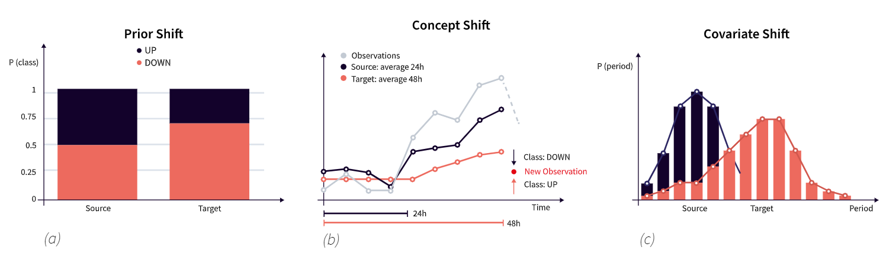
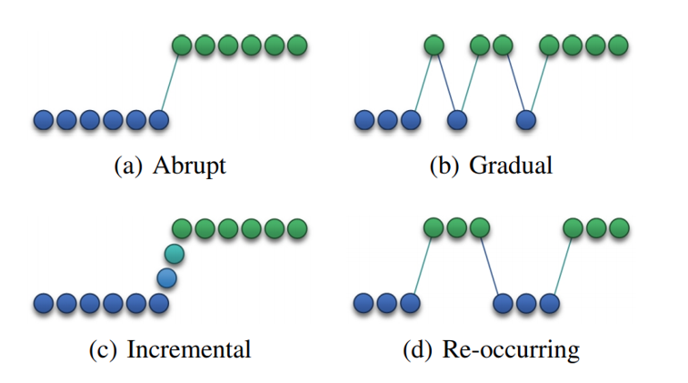

============
Desviaciones
============

La mayoria de los modelos de aprendizaje automático asumen que el conjunto de datos de entrenamiento ha sido generado de un origen de datos estático. Sin embargo, sabemos que está suposición es probablemente incorrecta, sobre todo si los datos han sido recolectados durante un periodo largo de tiempo. Los datos evolucionan ya que nuestro mundo también lo hace. En estos casos, es probable que la distribución de los datos que generó nuestro conjunto de datos cambie en algún momento.

Cuando un modelo de aprendizaje automático es desplegado de forma productiva, detectar estos cambios en la distribución de los datos es clave para asegurarse que las predicciones que generamos son válidas y que pueden ser consumidas de forma segura por otros procesos dentro de la organización.

Una desviación, o *data drift*, es una cambio en la distribución de los datos que se utilizan en un modelo de aprendizaje automático. Este cambio se da entre la distribución de los datos que se utilizó para entrenar el modelo, llamada *distribución de origen*, y la nueva distribución de los datos que se observa una vez que está desplegado, llamada *distribución objetivos*.

Tipos de desviaciones
---------------------
Existen 3 tipos de desviaciones dependiendo de que parte de nuestro conjunto de datos cambia su distribución: Cambio covariable (covariate shift), Cambio en la distribución previa (prior shift) y Cambio de concepto (concept shift). Las desviaciones de concepto son probablemente las más desafiantes y son las que mayoritareamente intetaremos monitorear.

.. _rst_covariate_shift:

Cambio covariable (covariate shift o feature drift)
^^^^^^^^^^^^^^^^^^^^^^^^^^^^^^^^^^^^^^^^^^^^^^^^^^^
Este tipo de desviación se da cuando la distribución de las variables predictoras (features) cambia, mientras que la distribución de la variable objetivo permanece igual. Un ejemplo tipico de este caso es cuando alguno de los valores de los predictores, previamente poco frecuente o incluso nunca visto (no está presente en el conjunto de entrenamiento) se vuelve más frecuente. 

.. math::
  P(x_s) \ne P(x_t) \textrm{ and } P(y_s|x_s)=P(y_t|x_t)

Cambio en la distribución previa (prior shift)
^^^^^^^^^^^^^^^^^^^^^^^^^^^^^^^^^^^^^^^^^^^^^^
Este tipo de desviación se da cuando la distribución de la variable objetivo cambia, mientras que la distribución de los restantes predictores permanece igual. Este tipo de cambios tipicamente se da cuando cambia la proporción de las muetras de alguna de las clases por ejemplo. Algo típico cuando trabajamos con conjuntos de datos que no están balanceados.

Cambio de concepto (concept shift)
^^^^^^^^^^^^^^^^^^^^^^^^^^^^^^^^^^
Se trata de un problema multifacético que se puede dividir en 2 categorías: real y virtual. Una desviación de concepto real es un cambio en la **distribución condicional** de la variable objetivo, independientemente de si la distribución de las variables predictores haya cambiado o no. 

.. math::
  P(y_s|x_s) \ne P(y_t|x_t) \textrm{ and } P(x_s) = P(x_t)

Una desviación de concepto virtual, también conocidas como temporales, puede ocurrir como resultado de una representación incompleta de la distribución real de los datos mas que como una cambio en el concepto que se intenta capturar. Esta separación es importante ya que para resolver una desviación de concepto real, se requiere de técnicas basadas en feedback para evaluar la performance del modelo de aprendizaje automático, mientras que una virutal puede realizarse sin tales técnicas.

.. image:: _images/concept_drifts.png
  :alt: Tipos de desviaciones de concepto

[Referencia]_

Dependiendo de cómo se introducen estos cambios a lo largo del tiempo, las desviaciones de concepto pueden ser categorizadas en abruptas, graduales y recurrentes. Una desviación abrupta es aquella que sucede de repente en un momento dado, pero cuyo efecto se mantiene en el tiempo. Una desviación gradual, es un cambio que se introduce paulativamente con pequeñas modificaciones constantes en el tiempo. Finalmente, una desviación recurrente es un cambio que se introduce de forma repentina, pero que también desaparece de forma repetina, aunque solo temporalmente.

[Referencia]_

Causas de una desviación
------------------------
En general, la mayoría de las desviaciones se pueden explicar por 3 causas:

1) **Técnica de muestreo sezgada:** Significa que la desviación se introdujo por un sezgo en la forma que se realizó el muestreo en el proceso de adquisición de datos. Esto significa que el conjunto de datos de entrenamiento no es representativo de toda la pobablación. Como ejemplo, considere un modelo que valora la satisfacción de un cliente en un banco. El conjunto de datos podría tener un sezgo si la encuesta de satisfacción solo se le envía a los clientes que operan vía home banking. En general, este problema encuentra su raiz en los mismos procesos de adquisición de datos. (Vea :ref:`rst_data_adquisition`)

2) **El conjunto de datos de origen no es representativo del conjunto de datos objetivo:** Esto sucede en general cuando nuestros conjuntos de datos capturan información de procesos continuos en el tiempo, por ejemplo, una predicción de ventas donde podría haber efectos de temporadas (seasonality).

3) **El proceso que genera los conjuntos de datos ha cambiado:** Este caso es el más sencillo de aceptar. Nuestro mundo es dinámico y de igual forma son los comportamientos de las personas y los dispositivos. Podria ser que la presición de un sensor de temporatura ha cambiado devido a un nuevo modelo del fabricante, la temporatura global está cambiando y como efecto el comportamiento del clima también lo hace, etc.

Algoritmos de adaptación
------------------------
Una forma de mitigar este problema sería que los modelos de aprendizaje automático se diseñaran con la idea de que existen desviaciones de concepto que están continuamente cambiando la distribución de los datos. Entonces, en lugar de mantiener el modelo estático e intentar detectar la desviación para luego poder reentrenar el modelo, estos modelos de aprendizaje automático actualizan constantemente sus parámetros cada vez que se observan nuevos datos. Esta técnica, si bien pareciera conveniente en principio, requiere de la utilización de modelos de aprendizaje automático que admitan este tipo de comportamiento. Algunos ejemplos pueden ser: Very fast decision tree (VFDT), Online information network (OLIN), Streaming ensemble algorithm (SEA), Online Non-stationary Boosting (ONSBOOST) y Online Sequential Extreme Learning Machine (OS-ELM).

.. note:: Estos algoritmos suponen que las desviaciones en la distribución de los datos es intrinseca del proceso que los genera y no de un error de modelado o de ingesta de información. Esto es importante de tener en cuenta porque podria incorrectamente opacar errores de integración de datos.

Algoritmos de detección
-----------------------
Existen numerosas técnicas para detectar desviaciones de datos. En general todos entran en alguna de las siguientes 3 categorias: 1) Basados en análisis secuencial, 2) Basados en la distribución de los datos, 3) Basados en las predicciones del modelo.

1) **Basados en análisis secuencial:** En estos métodos, los datos son analizados para inferir patrones a medida que son observados. Una desviación es detectada cuando la probabilidad de observar una secuencia de datos bajo la distribución actual de los datos es más grande que la probabilidad de detectar la secuencia en la distribución de los datos original. Ejemplos de estos métodos son Cumulative Sum (CUSUM) y su variante PageHinkley (PH).
2) **Basados en la distribución de los datos:** Analizan parámetros estadísticos como la media y la desviación estándar asociados con las predicciones para detectar desviaciones. Ejemplos de estos métodos incluyen The Drift Detection Method (DDM), Early Drift Detection Method (EDDM), Exponentially Weighted Moving Average (EWMA), y Reactive Drift Detection Method (RDDM), Kullback–Leibler divergence y Wasserstein metric.
3) **Basados en las predicciones del modelo:** Si tenemos acceso a los valores verdaderos de la variable objetivo, una forma sencilla de detectar las desviaciones es corriendo el modelo sobre el conjunto de datos objetivo y comparar la performance de las métricas con el conjunto de datos de entrenamiento. Sin embargo, en la vida real, la adquisición de los valores verdaderos de la variable objetivo puede ser costoso y adicionalmente, tener demora en el tiempo. Ejemplos de estos métodos incluyen Adaptive Windowing (ADWIN), SeqDrift, Hoeffding’s Bound (HDDMA-test and HDDMW-test) y Fast Hoeffding Drift Detection Method (FHDDM).

.. note:: No todos los métodos son apropiados para detectar todos los tipos de desviaciones. Recomendamos revisar la documentación de cada una de las técnicas para determinar que método es apropiado en cada ocasión.

Una vez que detectamos la desviación, el siguiente paso es el :ref:`rst_model_retrain` con un conjunto de datos actualizado.

Ejemplos
--------

.. toctree::
    :maxdepth: 1
    :titlesonly:

    code/domain_classifier.ipynb
    code/wasserstein.ipynb

.. [Referencia] Gama, J., Zliobaite, I., Bifet, A., Pechenizkiy, M., and Bouchachia, A. 2013. A Survey on Concept Drift Adaptation. ACM Comput. Surv. 1, 1, Article 1 (January 2013).