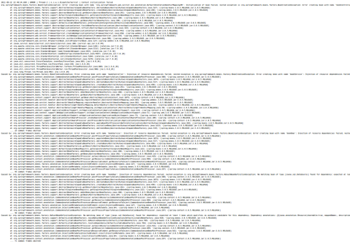

===============================
Diagnóstico y alertas
===============================

Cuando un modelo de aprendizaje automático es desplegado en producción, diferentes usuarios y procesos de negocio comentaran a interactuar con él. En este punto, los diferentes actores interesados en el despliegue necesitaran obtener información sobre cómo el modelo está performando, obtener información de diagnóstico cuando algo no funcione como se espera, y recibir alertas en cuando el modelo se comporte de una forma errónea. En sistemas tradicionales de software, esto puede ser sencillo de implementar, pero en sistemas basados en aprendizaje automático, interpretar cuando un modelo *no hace lo que debe hacer* puede ser complejo de implementar.

Diagnóstico
-----------
La práctica de recolección de información de diagnóstico se la conoce como *logueo* o *logging*. El logging nos permite persistir información específica de que acciones está ejecutando un determinado sistema de software, que información está viendo, y que resultados arroja. Dependiendo de la plataforma donde despleguemos nuestro modelo, alguna de esta información puede ser registrada de forma automática por el proveedor del servicio. Esto es el caso, por ejemplo, cuando desplegamos modelos en servicios de nube que disponen de servicios específicos. Sin embargo, en otros casos, es posible que debamos adaptar nuestro código para registrar propiamente dicha esta información. 

En general, vamos a querer registrar la mayor cantidad de información de diagnóstico posible, pero, tenga en cuenta que esto viene con el costo de su almacenamiento y, porque no, de la complejidad para quien debe revisar esta información de diagnóstico.

Información mínima a recolectar
^^^^^^^^^^^^^^^^^^^^^^^^^^^^^^^
Cómo minima, en general buscaremos implementar estrategias de logueo que puedan recolectar la siguiente información:
 - **Exectution time:** El tiempo que nuestro modelo tarda en ejecutarse y retornar al usuario.
 - **Timestamp:** Representan el momento en que el modelo comienza a ejecutarse. Es útil para la correlación de eventos y diagnostico de problemas.
 - **Prediction:** La predicción es, por supuesto, el resultado principal de un modelo. En muchos casos también registraremos el nivel de confianza o la probabilidad.
 - **Valores de entrada:** Representa la observación que el modelo recibe como dato de entrada y sobre donde debe ejecutarse. Podemos registrar la observación completa tal cual es suministrada al sistema (también conocida como *raw data*), es decir, sin ninguna transformación aplicada. En aquellos casos donde el tamaño de los datos es grande (por ejemplo en procesamiento por lotes o batch), quizás optemos por almacenar solamente un resumen estadístico de los valores que se recibieron (máximos, mínimos, valores nulos, valores en 0, cantidad de valores únicos, etc).
 - **Versión del modelo**: El número de versión del modelo que ejecutamos. Es una buena práctica disponer de identificadores únicos para los modelos.
 - **Runtime:** Versiones del software en general que se está utilizando (también conocido como *stack* o *environment*). Incluye versiones de librerías, versión de Python/R, versión del sistema operativo, etc. Esta información es útil sobre todo cuando las versiones de las librerías cambian y como consecuencia el comportamiento de las mismas.
 - **Requestor:** En muchos casos es útil tener información de como se está consumiendo el modelo. Si es via web, via un procesamiento en lotes (batch), etc. Requestor identifica al sistema que está realizando la solicitud. Por ejemplo, puede ser que un modelo esté performando mal cuando se lo consume desde el sitio web de la organización vs cuando se lo ejecuta vía batch en procesos de negocio.
 
 .. _rst_alerts:

Alertas
-------
La configuración de alertas es un elemento clave para poder reaccionar en tiempo y forma cuando nuestros modelos de aprendizaje automático están performando incorrectamente. Esto nos permite evitar dañar los procesos de negocio que descansan sobre ellos.

.. warning:: No confundir este tipo de alertas con automatización de procesos de negocios que emiten alertas ante una determinada condición. Por ejemplo, un modelo de aprendizaje automático podría predecir si una transacción es fraudulenta o no. Adicionalmente, un proceso de automátización podría disparar alertas basadas en estas predicciones para tomar alguna acción. El tipo de alertas al que refiere esta sección tiene que ver con el modelo per-se, y no con su interpretación de negocio.

En general implementaremos alertas cuando:
 - **Hay errores en tiempo de ejecución:** Esto refiere a cuando nuestro modelo falla a la hora de ejecutarse. Esto puede deberse por multiples motivos y requiere de investigación. Por ejemplo, puede ser que un método de código que se utilizaba ya no esté disponible en la nueva versión de la libreria, o que no funcione en el sistema operativo donde está instalada. En general, configuraremos alertas cuando la cantidad de errores de ejecución supera un umbral configurado.
 - **Las predicciones de nuestro modelo no están dentro de los rangos esperados:** Si por ejemplo disponemos de un modelo que clasifica transacciones fraudulentas y, de repente, nuestro modelo clasifica todo como `fraudulento`, tenemos sólida evidencia de que algo anda mal. En general, mantendremos valores estadísticos para determinar si las predicciones que genera el modelo se mantienen dentro de los valores esperados.
 - **La evaluación en linea del modelo decae:** Si repentinamente la performance de nuestro modelo disminuye mas allá de lo esperado, necesitaremos enterarnos tan pronto como sea posible. Por ejemplo, si está desplegando un modelo que predice la publicidad que se le mostrará a los usuarios en un sitio web y en los utltimos meses su taza de conversión es del 0% (cuando espera al menos tener un 3%). Para más información vea :ref:`rst_online_evaluation` 

