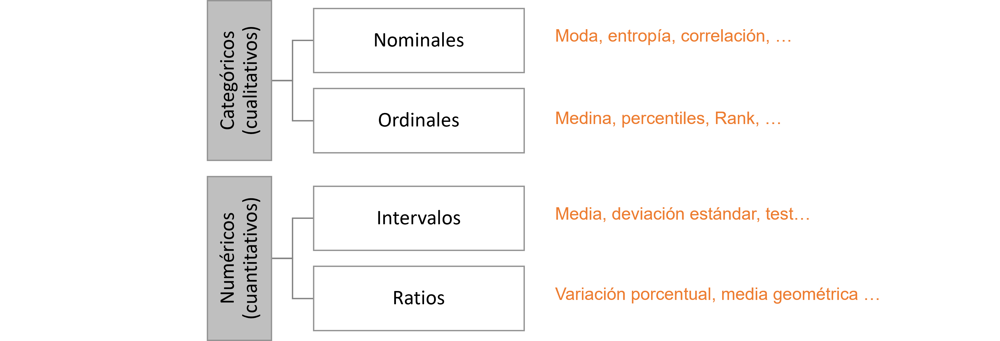

========================
Preparación de los datos
========================

Motivación
----------
Cuando los científicos o analistas de datos consideran las fuentes de datos para entrenar un modelo, primero deben asegurarse de que los datos lucen como esperan. El mejor modelo es tán bueno como la calidad de los datos que dispone. Sin embargo, una serie de problemas pueden impedir que todos o parte de los datos sean útiles, incluido el hecho de que estén incompletos, sean inexactos, inconsistentes, etc.

De todos modos, es fácil ver que se requiere conocimiento del dominio para tomar decisiones informadas durante la exploración y preparación de los datos. Algunas rarezas pueden ser difíciles de detectar para un inexperto, y algunas suposiciones pueder ser incorrectas para el ojo del facultativo. Considere el ejemplo de telemetría sobre una máquina en un dominio industrial: a menos que el científico de datos sea también un experto en la maquinaria o la industria, es posible que no sepa qué constituye valores atípicos normales para una máquina en particular.

Tareas en la preparación de datos
---------------------------------

Tipos de datos y conversión de tipo de datos
^^^^^^^^^^^^^^^^^^^^^^^^^^^^^^^^^^^^^^^^^^^^

Como parte del procesamiento de datos, muchas veces deberemos cambiar el tipo de los datos ya que cada tipo de dato ofrece diferentes operaciones que se le pueden aplicar.

   Tipos de datos y conversión de tipo de datos

Valores faltantes
^^^^^^^^^^^^^^^^^

En algunos casos, algunas de las instancias de datos con las que trabajamos podrían tener atributos vacíos o faltantes. Esto puede deberse a:

- La información no se recopiló
- Algunos atributos no son aplicables a todos los registros
- Hubo un error de conversión de tipos 

Hay varias estrategias (y variaciones) para tratar con datos faltantes, las cuales pueden ser apropiadas en determinadas circunstancias.

- Eliminar los registros con valores faltantes
- Estimar los valores faltantes (imputar)

  - Remplazar con un valor fijo
  - Remplazar con el valor mínimo
  - Remplazar con el valor mas probable
  - Estimar el valor utilizando información de los registros k “más similares” (moda / promedio)

- Ignorar los valores faltantes
 
  - Algunos algoritmos, como los árboles, pueden trabajar con valores faltantes (en general, la mayoría de los algoritmos no pueden manejar datos faltantes y debemos tomar una estrategia)

Valores inconsistentes
^^^^^^^^^^^^^^^^^^^^^^

Son valores para un atributo cuyo valor no hace sentido en la instancia en particular. En algunos casos estos valores pueden ser detectados como outliers, pero en otros casos pueden pasar más desapercibidos. En general debemos tratar a estos valores como valores faltantes y, por ende:

- Remplazar los valores inconsistentes por valores faltantes.
- Aplicar una estrategia de valores faltantes.

Valores duplicados
^^^^^^^^^^^^^^^^^^

Un conjunto de datos puede tener múltiples entradas del mismo dato. En algunos casos, esto puede ser una característica real, pero lo más común es que haga referencia a errores durante la captura de datos. Por ejemplo, muchos procesos de ingesta de datos no soporta correctamente el manejo de errores durante el proceso y, si se ejecutan 2 veces, datos duplicados se inyectan en el conjunto de datos final.

Mas allá de que estos problemas se originan durante el proceso de recolección de datos, es importante asegurarse de que el error no se propaga a nuestro modelado. ¿Por qué? Pues pueden introducir sesgo en los modelos de aprendizaje (bias).

Ejemplos
^^^^^^^^

.. toctree::
  :maxdepth: 1
  :titlesonly:

  code/dataprep.ipynb

Reproducibilidad
----------------

Sea cual sea el preprocesamiento de datos que elijamos hacer, es importante obtener un proceso que sea repetible y que produzca el mismo resultado independientemente del conjunto de datos que se le ingrese. Esto es importante ya que cuando llevemos nuestros modelos a producción y se encuentren con nuevas instancias de datos, deberemos de implementar las misma rutinas de preprocesamiento para que los datos sobre los que nuestro modelo fue entrenado y los datos que nuestro modelo ve en producción sean los mismos.

Esto implica:

- Registrar todas las operaciones de preprocesamiento que se realizan.
- Registrar cualquier valor que se calcula de forma dinámica sobre el conjunto de datos. Por ejemplo, medias, valores mínimos, etc.
- Registrar cualquier transformación que se realiza sobre los datos junto con sus parámetros. Por ejemplo, normalización.

Ejemplos
^^^^^^^^

.. toctree::
  :maxdepth: 1
  :titlesonly:

  code/modular.ipynb

Verificación
------------
El resultado del proceso de preparación de datos es un nuevo conjunto de datos con las propiedades y calidad de datos deseada. Cuando el proceso de preparación de datos está automatizado o forma parte de una rutina de entrenamiento, cómo en :doc:`../../projects/mlops/intro`, resulta interesante disponer de un proceso de verificación que se asegure que el conjunto de datos de salida tiene las propiedades que se esperan. Una forma de realizar esto es a través del concepto de `expectativas` o `expectations`.

Expectativas
^^^^^^^^^^^^
Una `expectativa` o `expectation` es una directiva que describe una propiedad verificable en un conjunto de datos. Si está familiarizado con el desarrollodo de código, al igual que `assertion` describe el comportamiento deseado del código, `expectation` describe el comportamiento deseado en los datos. Su utilización nos permite no sólo mejorar la calidad de los datos al hacer explicito nuestras demandas/suposiciones sobre los mismos sino que también es una forma efectiva para los propietarios de los datos de comunicar qué deben y qué no deben esperar de los datos los ingenieros de datos/cientificos de datos al utilizar tales conjuntos. 

Ejemplos
^^^^^^^^

.. toctree::
  :maxdepth: 1
  :titlesonly:

  code/expectations.ipynb

