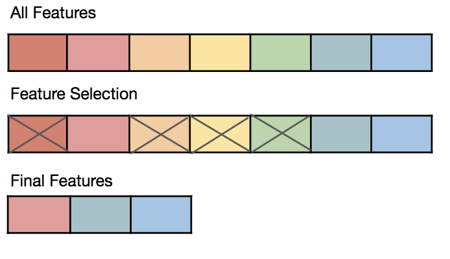
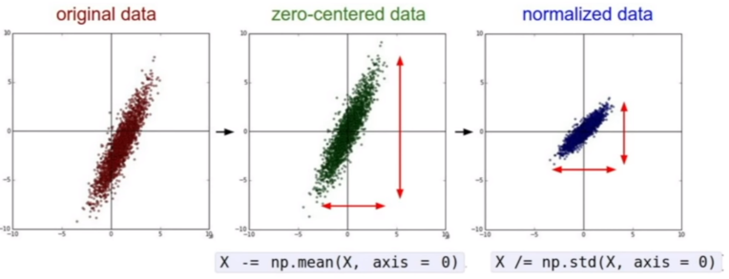

=========================
Ingeniería de predictores
=========================

Cuando hablamos de los métodos de aprendizaje automático clásicos (a diferencia de métodos basados en aprendizaje profundo) la ingenería de predictores hace referencia al proceso donde tomamos un conjunto de predictores del conjunto de datos original y lo transformamos en otro conjunto de datos el cual se cree, tiene más poder expresivo o es de mejor utilidad para nuestro modelo.

Proceso iterativo
-----------------

La ingeniería de predictores es un proceso iterativo por naturaleza. Por ejemplo, es posible que determinados modelos requieran determinada ingeniería de predictores y por lo tanto debamos implementar procesos específicos cada vez que el tipo de modelo cambia.

.. note:: Si bien existen formas de automatizar la ingenería de predictores con aquellos frameworks que implementan `automated ml`, estos suelen seleccionar no sólo el mejor conjunto de predictores sino que además el mejor modelo. Es decir, que el procedimiento de ingeniería y entrenamiento quedan acoplados. Si bien esto no es un problema, es importante marcar la diferencia.

Técnicas
--------

Subselección de predictores
^^^^^^^^^^^^^^^^^^^^^^^^^^^

La mayoría de los modelos no son inmunes a la `maldición de la dimensionalidad <https://en.wikipedia.org/wiki/Curse_of_dimensionality>`_. Este fenómeno sugiere que al aprender a partir de un conjunto de características de alta dimensionalidad, donde cada característica tiene un rango de valores posibles, normalmente requiere de una enorme cantidad de datos de entrenamiento para garantizar que haya varias muestras con cada combinación de valores posibles.

Esto quiere decir que existe un precio que los modelos pagan por tener más predictores a los cuales prestar atención. Una forma de reducir la dimensionalidad de las características es usar sólo un subconjunto de ellas, sobre todo en el caso de existir predictores redundantes o irrelevantes. Esto se conoce como *Subselección de predictores*.

   Selección de predictores

Existen otras ventajas asociadas como:

- Mejora la performance de entrenamiento
- Reduce los requerimientos de memoria y cómputo
- Algunos modelos se degradan ante la presencia de predictores no informativos y con colinealidad.

En general eliminaremos predictores:

- **Redundantes:** cuando varios predictores codifican la misma información de varias formas. Esto introduce problemas de correlación y sesgo.
- **Irrelevantes:** cuando el predictor casi no dispone de información útil para la tarea en cuestión. 

Existen varias alternativas para implementar este método:

:Probar todos los subsets posibles: Es un método costoso computacionalmente, pero efectivo.
:Búsqueda: Busca una combinación de predictores utilizando un método de búsqueda. Este subset luego se evalúa o bien utilizando algún criterio o contra la tarea especifica. Vea :doc:`selection` para más detalle.
:Mantener los K predictores más relevantes: Utilizando algún algoritmo de ranking, por ejemplo, Correlación de Pearson, Jaccard, similaridad del coseno, etc; con la variable a predecir. Esto se lo conoce como *Filtering*.
:Utilizar un algoritmo que haga selección de predictores automáticamente: Ejemplos de estos algoritmos son *Lasso* o *Random Forest*.

.. toctree::
   :maxdepth: 1
   :caption: En esta sección
   :hidden:

   Búsqueda y selección de predictores <selection>

Extracción de predictores
^^^^^^^^^^^^^^^^^^^^^^^^^

Mientras la subselección de predictores trata de reducir la cantidad de predictores, la extracción trata de incrementarlos o transformarlos. Esta transformación puede cambiar el espacio de los predictores por uno más denso por ejemplo, donde la información muestra otra extructura. Otra alternativa es generar nuevos predictores computando nuevos valores. Por ejemplo, calcular el tiempo transcurrido entre 2 fechas.

Existen múltiples técnicas para extraer predictores:

:Transformación: Se refiere a aplicar una transformación a todos los valores de una variable. Estas transformaciones por lo general son no lineales.
:Construcción: Se refiere a crear nuevos predictores basándose en los valores de otros predictores. Un ejemplo de esto es la construcción del predictor "horas" dadas dos fechas de inicio y fin. La construcción de estos predictores ademas tiene la ventaja de que facilita la interpretación del modelo.
:Discretización (variables continuas): Básicamente consta de la creación de nuevos predictores basados en rangos de valores en variables continuas.
:Binerización (variables categóricas): Básicamente consta de la creación de nuevos predictores basados en agregaciones de varios valores de variables categóricas.

Reducción de dimensionalidad
^^^^^^^^^^^^^^^^^^^^^^^^^^^^

Las técnicas de reducción de dimensionalidad son parte de las técnicas de Extracción de predictores, pero buscan reducir la cantidad de predictores en lugar de aumentarla. En particular, merece la pena mencionarlas porque disponen de procedimientos especificos dependiendo de las necesidades:

:Métodos lineales: Generan proyecciones lineales de los datos originales a un espacio dimensional menor. Ejemplos de estos métodos son Principal Component Analysis (PCA), Factor Analysis (FA), Linear Discriminant Analysis (LDA), Truncated Singular Value Decomposition (SVD)
:Métodos no-lineales: Introducen transformaciones no-lineales que alteran el espacio (manifold). Ejemplos de estos métodos son Kernel PCA, t-distributed Stochastic Neighbor Embedding (t-SNE), Multidimensional Scaling (MDS) o Isometric mapping (Isomap).

.. warning:: Las técnicas de reducción de dimensionalidad aplican transformaciones a los datos que deden ser aplicadas tanto durante la fase de entrenamiento como de inferencia. Por este motivo, es necesario registrar y persistir estas transformaciones para asegurar su consistencia en tiempo de inferencia. Vea :doc:`../ops/adaptation/intro`.

Escalamiento y normalización
^^^^^^^^^^^^^^^^^^^^^^^^^^^^

Algunos modelos de aprendizaje automático pueden ser sensibles a las escalas de sus predictores. Podría ser por ejemplo un predictor Velocidad (en KM/h) vs un predictor distancia (en metros). En general, cualquier modelo que utilice la idea de distancia por ejemplo será sencible a esto.

El escalamiento y normalización puede ser requerido (o sugerido) por un modelo que utilizamos. Podrían requerir predictores:

:Centrados: Los valores que pueden tomar el predictor se distribuyen sobre el espacio de forma equitativa.
:Escalados: Todos los predictores tienen el mismo rango de valores/escala.
:Normales: Media 0 y desviación estándar 1.

   Escalamiento y normalización

.. warning:: Las técnicas de normalización aplican transformaciones a los datos que deden ser aplicadas tanto durante la fase de entrenamiento como de inferencia. Por este motivo, es necesario registrar y persistir estas transformaciones para asegurar su consistencia en tiempo de inferencia. Vea :doc:`../ops/adaptation/intro`.

Vectorización
^^^^^^^^^^^^^

Un modelos de aprendizaje automático es, a groso modo, una función parametrizada `f(x)` que toma como entrada un vector `x`, `n-dimensional`, y produce un vector de salida `m-dimensional`. Tal función puede ser simple (para un modelo lineal por ejemplo) o más compleja (como una red neuronal). En muchos casos, nuestros datos de entrada representarán características discretas y categóricas, las cuales no pueden ser traducidas directamente a números que estas funciones puedan utilizar. ¿Cómo codificamos esos datos categóricos de una manera que sea práctica para ser utilizada por un modelo de aprendizaje automático? Este proceso en general se lo llama *encoding* aunque en la jerga de aprendizaje profundo se lo suele llamar *vectorización*.

Existen diferentes modos de codificar estas variables categóricas y discretas:

- One-hot encoding
- Index-based encoding
- Embeddings

Almacenes de predictores (Feature stores)
-----------------------------------------

Los almacenes de predictores (Feature stores) son repositorios centralizados donde se almacenan todas las diferentes características asociadas con una organización o una vertical del negocio y cuyo objetivo es facilitar su reutilización. Por lo general, ofrecen la capacidad de consumir características de forma offline, es decir cuando se diseña el modelo, y online, es decir cuando el modelo está en ejecución, lo que asegura de que sean coherentes entre sí. Dado el tiempo que consume la ingeniería de predictores, estas implementaciones tienen un enorme potencial para aumentar la productividad de los cientificos de datos. 

En general estos sistemas, tiene propiedades como:

- Ofrecen un modelo conceptual para describir tanto características que cambian lentamente como aquellas que son altamente volátiles.
- Mecanismos para la ingesta continua de información.
- Permitir procesamiento del lado del servidor (como predictive push-down) para el filtrado y cálculo de agregaciones, así como también el procesamiento del lado del cliente utilizando streamming de datos.
- Flexibilidad para manejar volumenes de datos grandes, como así también conjuntos de datos de menor tamaño pero con un gran valumen de actualización.
- Flexibilidad para administrar el versionamiento de los datos y control de cambios.
- Una interfaz de acceso integrada con la mayoría de los frameworks de aprendizaje automático.
- Manejo de versiones explícito para poder asegurar reproducibilidad en los experimentos.
- Seguimiento del linaje de los datos asi como herramientas para explorarlo.

Un ejemplo de este tipo de plataformas es `Databricks` o `Feast`.

