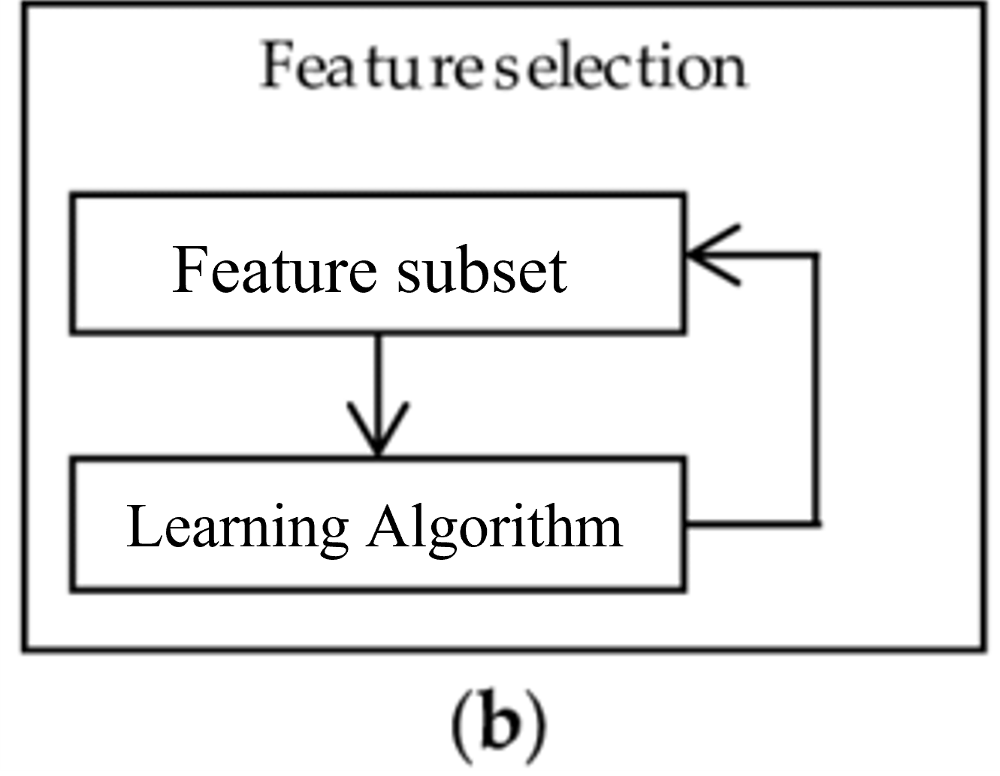
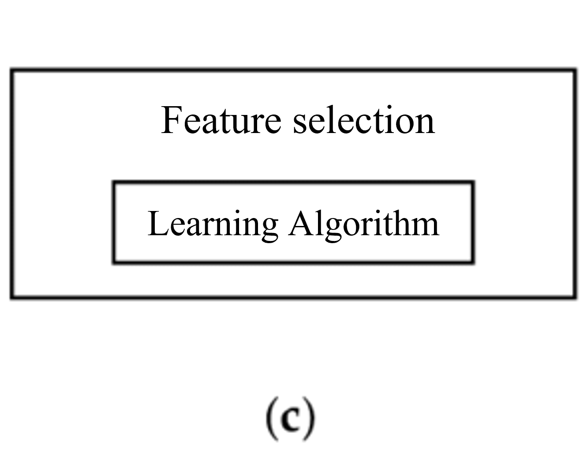

===================================
Búsqueda y selección de predictores
===================================

Una parte importante del aprendizaje automático es utilizar una buena representación para los datos. Selección de predictores es el procedimiento por el cual se reduce el número de predictores. En general tenemos 2 métodos:

Wrapping
--------

El método tiene acceso al modelo de clasificación y usa las predicciones del modelo para seleccionar o eliminar iterativamente un conjunto de predictores. El proceso de selección es una parte integral del modelo. Esto quiere decir que se entrenan tantos modelos como subsets se prueban. Para `n` predictores, evalúa `n(n − 1)/2` modelos.

   Búsqueda y selección de predictores: Wrapping

Se utiliza un algoritmo de búsqueda:

:RFE (recursive feature elimination): Se comienza con todos los predictores y luego se va eliminando el predictor con menor peso en el modelo. Estos métodos solo funcionan con modelos donde tengamos coeficientes disponibles, como ser las regresiones y las SVM.
:Forward Sequential Selection: Se comienza con un conjnuto aleatorio de predictores. Luego, aleatoriamente se agrega un nuevo predictor y se calcula la performance. Si mejora, el predictor se queda, si no mejora, se descarta.
:Backward Elimination: Se comienza con un todo el conjunto de predictores posibles. Luego, aleatoriamente se elimina un predictor y se calcula la performance. Si la performance mejora, el predictor se elimina. Si no se queda.
:Genetic Algoritm: se basa en un proceso de selección natural biológico.

Embedded
--------

Este método descansa en la capacidad del modelo de disponer de una metodología interna para "categorizar" o "rankear" a los predictores que utiliza. Aquí, se construye un modelo de clasificación utilizando un conjunto de entrenamiento y la performance del modelo se estima usando un conjunto de evaluación. El modelo que se creó proporciona el valor de “ranking” o relevancia para cada predictor y por lo tanto se eliminan aquellos predictores que no tiene tanta relevancia.

   Búsqueda y selección de predictores: Embedded

Los modelos basados en arboles ofrecen esta funcionalidad, sin embargo no es una técnica que se pueda aplicar a cualquier tipo de modelo. A pesar de esto, existen métodos genéricos para calcular la importancia de un predictor en un determinado modelo. Por ejemplo *Permutation Feature Importance*. Sin embargo, estos métodos son aproximaciones y tiene que ver más con técnicas de interpretación de modelos más que de identificación de relevancia para el modelo.

