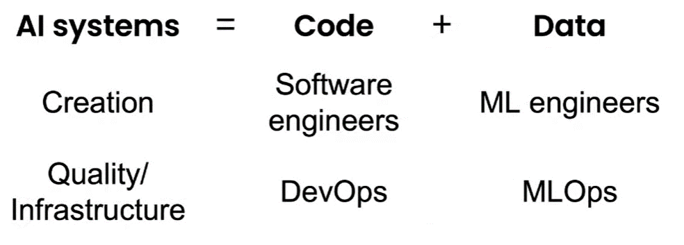

.. _rst_mlops:

=====
MLOps
=====

Una característica importante para destacar sobre los sistemas de software basados en aprendizaje automático tiene que ver que estos sistemas se diseñan de forma distinta a como se diseña un sistema de software tradicional. Mientras la codificación representa una gran parte del tiempo que se invierte en un software tradicional, en sistemas basados en aprendizaje automático la codificación representa solo una pequeña parte del problema. En particular, este hecho nos da la posibilidad de diseñar sistemas que son *data-driven*, es decir, software que se adapta a medida que los datos cambian y que por lo tanto deben ser actualizados con mayor frecuencia para reflejar dichos cambios. Con esta habilidad de poder diseñar sistemas que son *data-driven* y, poder ofrecer un mayor valor al negocio o la organización, aparecen los desafios para los ingenieros de software de como orquestar estos cambios de manera confiable, repetible y ágil. 

¿Qué es MLOps?
--------------
MLOps, si bien inspirado en la ya madura práctica de DevOps, es un campo nuevo por lo que su significado aún es objeto de debate. Entre las definiciones más utilizadas están:

nVidia
 - Un conjunto de prácticas para que los negocios puedan implementar AI satisfactoriamente.
ml-ops.org
 - MLOps apunta a unificar el ciclo de publicación de modelos de aprendizaje automático con el ciclo de publicación de software.
Google
 - MLOps es una cultura y práctica de ingeniería que apunta a unificar los sistemas de desarrollo de modelos de aprendizaje con los sistemas de operacionalización. La práctica de MLOps abarca la automatización y monitoreo de todos los pasos en la construcción de un modelo de aprendizaje automático; incluyendo integración, testeo, publicación, despliegue y administración de la infraestructura.

Desafíos para las organizaciones
--------------------------------
Uno de los desafíos más grandes que una organización enfrenta hoy en día en lo que respecta a MLOps es que, a la actualidad, el campo de MLOps está muy orientado a las herramientas. Es decir, los flujos de desarrollo y despliegue de modelos de aprendizaje automático están focalizados en las herramientas que lo permiten: utilizar la herramienta A para realizar X, la herramienta B para realizar Y, etc. El riesgo asociado es que las herramientas cambian, evolucionan y fuezan a las organizaciones a cambiar en la misma dirección, independientemente de si están de acuerdo o no. En el otro extremo, no podemos implementar MLOps *filosóficamente* basandonos en teoría, es decir, debemos mantenerlo práctico. El área de arquitectura de datos en conjunto con los Arquitectos de Aprendizaje Automático (ML Architect) tienen la responsabilidad de encontrar el balance correcto entre que tanto descansar en las herramientas, y que tanto es necesario que la organización adopte su propio proceso (y lo implemente).

Perfil de un ingeniero de operaciones de MLOps
^^^^^^^^^^^^^^^^^^^^^^^^^^^^^^^^^^^^^^^^^^^^^^
Es una convinación de habilidades de desarrollo de software, infraestructura y en general la teoría detras de los modelos de aprendizaje automático. Quizás, la parte más importante tiene que ver con el entendimiento de todo el proceso de desarrollo de un modelo de aprendizaje automático. 

Data-centric vs Model-centric
-----------------------------
Podríamos decir que un modelo de aprendizaje automático es una fotografía de cómo el mundo solía lucir cuando se recolectó el conjunto de datos de entrenamiento. Dependiendo del dominio en el que estemos trabajando, este hecho podría no representar un problema, por incluso, bastante tiempo. Sin embargo, en otros casos y como consecuencia de vivir en un mundo que no es estático, es necesario que el modelo y el conocimiento que el modelo extrajo desde el conjunto de datos evolucione junto con los datos.

En los sitemas basados en aprendizaje automático, aquellos que utilizan la mayor cantidad y calidad de datos son los ganadores. Esta realidad hace que muchos equipos de desarrollo se focalizen en la mejora continua de sus datos <data centric> en lugar de la arquitectura del modelo <model centric>. Los datos pueden cambiar con una gran velocidad, lo que impone restricciones fuertes en la velocidad en la que los modelos deben moverse a lo largo de todo el proceso de desarrollo. ¿Cómo poveer entonces está velocidad a los equipos de desarrollo?

.. toctree::
   :maxdepth: 2
   :caption: En esta sección
   :hidden:
   
   CI/CD <cicd>